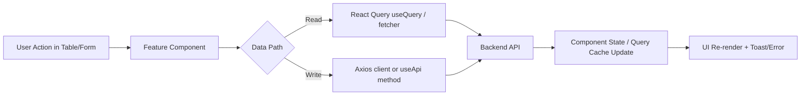

# GoGoCash Admin Architecture Guide

This repository is a **Next.js 15 + React 19** admin panel for GoGoCash operations.

This README is intentionally architecture-first so new developers can:
- understand data flow quickly,
- know where to change code safely,
- add new modules with less trial-and-error.

## 1) Project Purpose

The app is an operations dashboard for:
- admin users
- regular users
- offers
- offer coupons
- withdraw requests
- conversion records
- fee settings
- categories
- homepage banners

Most business actions are management CRUD or status update workflows against a backend API.

---

## 2) Stack and Runtime

### Frontend runtime
- Next.js `15.2.3` (App Router)
- React `19`
- TypeScript `strict`
- Tailwind CSS `v4`

### State/data/auth
- NextAuth (credentials provider, JWT session strategy)
- TanStack React Query (read-heavy areas)
- Local component state (`useState`, `useEffect`) for table/list management in many modules

### UI libraries
- Tailwind utility styling + project utility classes in `src/app/globals.css`
- MUI (`@mui/x-data-grid`) for tabular detail views
- ApexCharts for analytics charts
- FullCalendar for calendar demo page

### Network
- Axios via two patterns:
  1. `src/lib/api.ts` (typed API client wrapper)
  2. `src/lib/axios/client.ts` (shared Axios instance + interceptor)

---

## 3) Top-Level Folder Map

```text
.
├── src/
│   ├── app/                     # Next.js App Router pages/layouts/api routes
│   ├── components/              # Feature modules + shared UI primitives
│   ├── context/                 # Sidebar/theme context providers
│   ├── hooks/                   # Reusable hooks (api, modal, go-back)
│   ├── lib/                     # API clients + query client
│   ├── types/                   # Domain model/type contracts
│   └── utils/                   # Formatting/helper utilities
├── public/                      # Static assets
├── k8s/                         # Kubernetes deployment manifests
├── Dockerfile                   # Container build
├── cloudbuild.yaml              # GCP Cloud Build pipeline
├── app.yaml                     # App Engine deployment config
└── deploy.sh                    # Manual GCP deployment helper
```

---

## 4) Routing Architecture (App Router)

### Route groups

- `src/app/(admin)`
  - authenticated dashboard shell
  - includes header/sidebar/backdrop layout
  - includes all business pages

- `src/app/(full-width-pages)`
  - auth and error pages with separate full-width layout

- `src/app/api/auth/[...nextauth]/route.ts`
  - NextAuth credentials entrypoint

### Primary business routes

- `/` dashboard (template analytics widgets)
- `/admin-users`
- `/users`
- `/offers`
- `/offers/[id]` (offer detail + coupon grid)
- `/withdraw`
- `/withdraw/[id]` (per-user withdraw/conversion detail)
- `/conversion`
- `/fee`
- `/category`
- `/banner`
- `/coupon`

Most page files are thin wrappers that render:
1. `PageBreadcrumb`
2. one feature table/form component

This keeps page-level files simple and moves real logic into feature components.

---

## 5) Layout and Provider Composition

### Root layout
File: `src/app/layout.tsx`

- loads global CSS and Outfit font
- wraps app with `ClientProviders`

### Client provider order
File: `src/components/providers/ClientProviders.tsx`

Provider nesting:
1. `QueryClientProvider`
2. `SessionProvider`
3. `ThemeProvider`
4. `Toaster`
5. `SidebarProvider`

This means any component can use:
- React Query
- NextAuth session
- theme toggling
- sidebar state
- toast notifications

### Admin shell
File: `src/app/(admin)/layout.tsx`

- wraps all admin pages with `AuthGuard`
- renders `AppSidebar`, `AppHeader`, `Backdrop`
- dynamically changes left margin based on sidebar expanded/hover/mobile state

---

## 6) Authentication and Session Flow

### NextAuth strategy
File: `src/app/api/auth/[...nextauth]/route.ts`

- Credentials provider calls backend login: `apiClient.login(...)`
- login endpoint used: `/admin/login`
- backend token is attached to NextAuth JWT (`token.accessToken`)
- session callback exposes `session.accessToken`
- session strategy = JWT, max age 24h
- custom sign-in page = `/signin`

### Route protection
File: `src/components/auth/AuthGuard.tsx`

- uses `useSession()`
- while loading: spinner
- unauthenticated: redirects to `/signin`
- authenticated: renders children

### Logout
File: `src/components/header/UserDropdown.tsx`

- `signOut({ callbackUrl: "/signin" })`

---

## 7) Data Layer and API Client Architecture

There are **two parallel API patterns** in current codebase.

## 7.1 Typed API wrapper (`src/lib/api.ts`)

This class wraps endpoints with typed methods and central error normalization.

Key characteristics:
- Base URL: `process.env.NEXT_PUBLIC_API_URL || "https://api.gogocash.co"`
- Uses Axios internally via dynamic import inside `request<T>()`
- Converts Axios errors to `ApiError` shape

Main methods include:
- auth: `login`, `register`, `logout`, `getProfile`, `refreshToken`
- admin users: `getAdminUsers`, `getAdminUser`, `createAdminUser`, ...
- users: `getUsers`, `getUser`, `updateUser`, ...
- offers: `getOffers`, `getOffer`, `createOffer`, `updateOffer`, ...
- operations: `getWithdraws`, `getConversion`, `getFee`, `updateFee`, `updateListOffer`

## 7.2 Axios singleton (`src/lib/axios/client.ts`)

This client is used directly in many feature forms and React Query fetchers.

Key characteristics:
- request interceptor pulls `getSession()` and sets `Authorization: Bearer <token>`
- exported helpers: `fetcher`, `fetcherPost`, `fetcherPut`

Used heavily for:
- multipart form uploads (offer/category/banner/withdraw updates)
- direct React Query endpoint fetches

## 7.3 Hook abstraction (`src/hooks/useApi.ts`)

`useApi` wraps `apiClient` methods and centralizes:
- `loading`
- `error`
- `clearError`
- token extraction from session

Modules using `useApi` get a uniform interface and consistent error handling.

---

## 8) React Query Strategy

Query client config: `src/lib/query/queryClient.ts`

Defaults:
- `refetchOnWindowFocus: false`
- `refetchOnMount: false`
- `refetchOnReconnect: false`
- `staleTime: 0`

Implication:
- data is always considered stale immediately,
- but auto-refetch triggers are mostly disabled,
- so manual refetch/query-key changes drive updates.

Current pattern in modules:
- Some modules use `useQuery` (coupon/banner/category/detail pages)
- Other modules use manual `useEffect + fetchX` (users/offers/withdraw/conversion)

---

## 9) Domain Modules (Deep Dive)

## 9.1 Admin Users
Files:
- `src/components/admin/AdminUsersTable.tsx`
- `src/app/(admin)/(others-pages)/admin-users/page.tsx`

Flow:
- query state stored locally (`limit/page/search`)
- fetch via `useApi().getAdminUsers`
- delete via `useApi().deleteAdminUser`
- simple table rendering + manual pagination controls

Notes:
- pagination flags `hasNextPage/hasPrevPage` are currently hardcoded false in component state update.

## 9.2 Users
Files:
- `src/components/user/UsersTable.tsx`
- `src/components/user/FormUpdate.tsx`
- `src/components/user/ViewMyCashback.tsx`
- `src/app/(admin)/(others-pages)/users/page.tsx`

Flow:
- list users from `/user` via `getUsers`
- edit mobile in modal via `POST /admin/update-user/:id` (multipart)
- “View” navigates to `/withdraw/:userId` for user-centered finance view
- `ViewMyCashback` modal uses React Query + `fetcher` (`/admin/get-mycashback-user/:id`)

Phone handling:
- formatting + validation via `libphonenumber-js` wrappers in `src/utils/helper.ts`

## 9.3 Offers
Files:
- `src/components/offer/OffersTable.tsx`
- `src/components/offer/FormOffer.tsx`
- `src/app/(admin)/(others-pages)/offers/page.tsx`

Flow:
- list via `getOffers` hitting `/offer/admin`
- search, pagination, country filter
- sync external offers via `updateListOffer` (`/involve`)
- edit modal updates offer assets/settings via `PATCH /admin/update-offer/:id` multipart
- row click navigates to `/offers/[id]`

Image source pattern:
- backend file path rendered as `${NEXT_PUBLIC_API_URL}/google-drive/file/<path>`

## 9.4 Offer Detail + Coupons
Files:
- `src/components/offer/Detail.tsx`
- `src/components/coupon/FormCoupon.tsx`
- `src/app/(admin)/(others-pages)/offers/[id]/page.tsx`

Flow:
- offer detail query: `/offer/:id`
- coupon query by offer: `/offer/get-coupon-id/:id`
- coupon CRUD-like update endpoint: `POST /offer/update-coupon`
- MUI DataGrid is used for coupon table/actions

`FormCoupon` supports:
- optional offer picker (autocomplete from offers)
- date/code/link/discount/min spend fields
- create and edit via same endpoint payload

## 9.5 Coupon Listing (global)
Files:
- `src/components/coupon/CouponTable.tsx`
- `src/app/(admin)/(others-pages)/coupon/page.tsx`

Flow:
- fetches `/offer/get-coupon` with query params
- renders full coupon list across offers
- open modal for create/edit

## 9.6 Category
Files:
- `src/components/category/CategoryTable.tsx`
- `src/components/category/FormCategory.tsx`
- `src/app/(admin)/(others-pages)/category/page.tsx`

Flow:
- fetch categories: `/offer/get-category/list` (+ search)
- update category image: `PATCH /admin/update-category/:categoryId`

## 9.7 Banner Homepage
Files:
- `src/components/banner/BannerTable.tsx`
- `src/components/banner/FormUpdate.tsx`
- `src/app/(admin)/(others-pages)/banner/page.tsx`

Flow:
- fetch current banner set: `/admin/banner-home`
- manage five slots (`image_1..5`, `link_1..5`)
- submit updates: `POST /admin/banner-home` multipart

## 9.8 Withdraw
Files:
- `src/components/withdraw/WithdrawTable.tsx`
- `src/components/withdraw/ModalWithdraw.tsx`
- `src/components/withdraw/WithdrawDetail.tsx`
- `src/app/(admin)/(others-pages)/withdraw/page.tsx`
- `src/app/(admin)/(others-pages)/withdraw/[id]/page.tsx`

Flow (list page):
- fetch all requests: `/admin/withdraw-all`
- search/paginate
- open modal to approve/reject pending records

Update flow:
- modal submits `PATCH /admin/update-request-withdraw` multipart
- status + optional slip file upload
- business guard: only `bank_transfer` method can be updated in modal action

Flow (detail page by user):
- conversion+withdraw aggregate: `/withdraw/list-check-admin/:id`
- mycashback summary: `/withdraw/check-my-cashback-admin/:id`
- DataGrid views for conversions and withdraw records

## 9.9 Conversion
Files:
- `src/components/conversion/ConversionTable.tsx`
- `src/app/(admin)/(others-pages)/conversion/page.tsx`

Flow:
- fetch conversions: `/admin/conversion-all` with key/status/search
- manual conversion refresh/update: `PATCH /admin/update-conversion/:conversionId`

Search model supports key-based search (`aff_sub1`, `conversion_id`, `adv_sub*`).

## 9.10 Fee
Files:
- `src/components/fee/FeeForm.tsx`
- `src/app/(admin)/(others-pages)/fee/page.tsx`

Flow:
- fetch fee settings: `/admin/get-fee-rate`
- update fee settings: `/admin/update-fee-rate/:id` via `apiClient.updateFee`

Fields include:
- system percent
- withdrawal fees (THB/USD)
- minimum withdrawal (THB/USD)

---

## 10) Shared UI Architecture

Reusable primitives exist under `src/components/ui` and `src/components/form`.

Important shared building blocks:
- `Modal` (`src/components/ui/modal/index.tsx`)
- `Dropdown` (`src/components/ui/dropdown/Dropdown.tsx`)
- `Input` (`src/components/form/input/InputField.tsx`)
- `Select` (`src/components/form/Select.tsx`)
- `Switch` (`src/components/form/switch/Switch.tsx`)
- `PageBreadcrumb`, `Card`

Most business modals/forms rely on these primitives for visual consistency.

---

## 11) Styling and Theme System

File: `src/app/globals.css`

Highlights:
- Tailwind v4 theme tokens (`@theme`) for color scales, spacing, breakpoints
- custom utilities for menu states and scrollbars
- dark mode variant powered by `.dark` class
- third-party style overrides for ApexCharts, Flatpickr, FullCalendar

Theme state:
- `ThemeContext` reads/writes localStorage key `theme`
- toggles `document.documentElement.classList` for dark mode

---

## 12) Sidebar/Header Interaction Model

Sidebar state context (`src/context/SidebarContext.tsx`) controls:
- expanded/collapsed desktop mode
- mobile open/close mode
- hover expansion behavior

Header (`src/layout/AppHeader.tsx`) uses this context to:
- toggle sidebar by viewport rules
- support command search focus shortcut (`Cmd/Ctrl + K`)

Sidebar nav config is static in `src/layout/AppSidebar.tsx` and should be updated when adding new modules.

---

## 13) Type System and Contracts

Types are grouped by domain in `src/types`:
- `api.ts` (core transport/domain types)
- `user.ts`
- `withdraw.ts`
- `coupon.ts`
- `banner.ts`
- `category.ts`

Guideline when extending:
1. Add/adjust types first
2. Update `apiClient` method signatures
3. Wire through `useApi`
4. Consume in UI

This sequence minimizes runtime mismatch and improves IDE guidance.

---

## 14) Request Lifecycle (Typical)



Auth-aware calls usually depend on:
- `session.accessToken` from NextAuth
- `Authorization: Bearer <token>` header

---

## 15) Environment Variables

Required:
- `NEXT_PUBLIC_API_URL` (backend base URL)
- `NEXTAUTH_SECRET`
- `NEXTAUTH_URL`

Used in code:
- API base URL in `src/lib/api.ts` and `src/lib/axios/client.ts`
- NextAuth secret in `src/app/api/auth/[...nextauth]/route.ts`
- image file URL composition in multiple modules

---

## 16) Local Development

```bash
npm install
npm run dev
```

or

```bash
yarn install
yarn dev
```

Default app URL: `http://localhost:3000`

No automated test suite is configured in this repository at the moment.

---

## 17) Deployment Architecture

Deployment assets included:
- Docker multi-stage build: `Dockerfile`
- Cloud Run pipeline: `cloudbuild.yaml`
- App Engine config: `app.yaml`
- Kubernetes manifests: `k8s/*.yaml`
- helper script: `deploy.sh`

Targets supported:
- Cloud Run (recommended in docs)
- App Engine
- GKE

Note: ensure environment variables are supplied at deployment time (especially auth + API URL).

---

## 18) Fast Extension Playbook (How to Add a New Module)

1. Add route page under:
   - `src/app/(admin)/(others-pages)/<module>/page.tsx`
2. Create feature component folder/file under:
   - `src/components/<module>/...`
3. Define DTO/types in `src/types/...`
4. Add API method(s) in `src/lib/api.ts`
5. Expose method(s) via `src/hooks/useApi.ts`
6. Add nav entry in `src/layout/AppSidebar.tsx`
7. Reuse existing primitives (`Modal`, `Input`, `Select`, `Card`, `PageBreadcrumb`)
8. For read-heavy data, prefer `useQuery` with stable `queryKey`
9. For writes, keep success/error UX consistent (toast + refetch/update)

If you follow this pattern, new modules stay consistent with existing architecture.

---

## 19) Current Architecture Notes (Important for New Devs)

These are not blockers, but they are useful to know before making larger changes:

- API integration is split across two styles (`apiClient` + direct `client` usage).
- Some docs in repository still reflect template/default or old endpoint examples.
- Several pages/components are still template/demo oriented (dashboard widgets, signup form social buttons).
- Pagination metadata handling is inconsistent across modules.

When refactoring, a high-impact improvement is to unify all modules on one API calling style plus standardized query/mutation hooks.

---

## 20) Quick File Index (Most Important Files)

- Root app layout: `src/app/layout.tsx`
- Admin shell: `src/app/(admin)/layout.tsx`
- NextAuth route: `src/app/api/auth/[...nextauth]/route.ts`
- Provider composition: `src/components/providers/ClientProviders.tsx`
- API client (typed): `src/lib/api.ts`
- Axios client (interceptor): `src/lib/axios/client.ts`
- API hook facade: `src/hooks/useApi.ts`
- Sidebar navigation map: `src/layout/AppSidebar.tsx`
- Global styles/tokens: `src/app/globals.css`

---

If you need, the next step can be a second document (`ARCHITECTURE_DECISIONS.md`) that tracks conventions and refactor roadmap (API unification, module scaffolding template, and test strategy).
