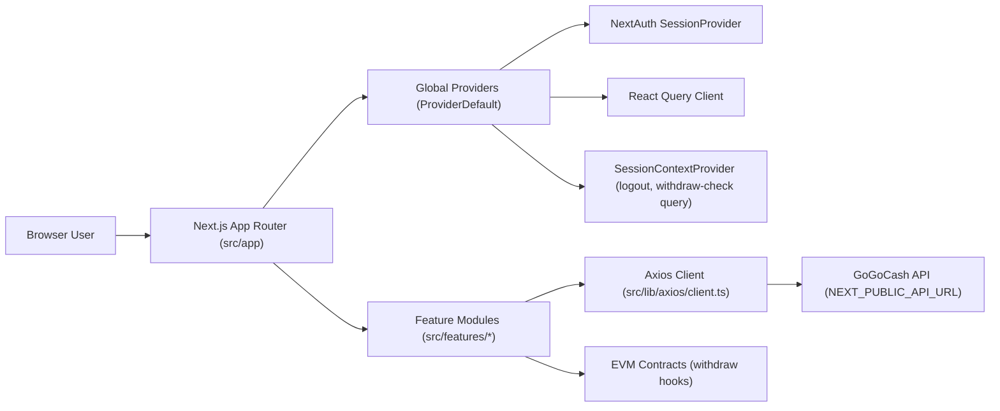
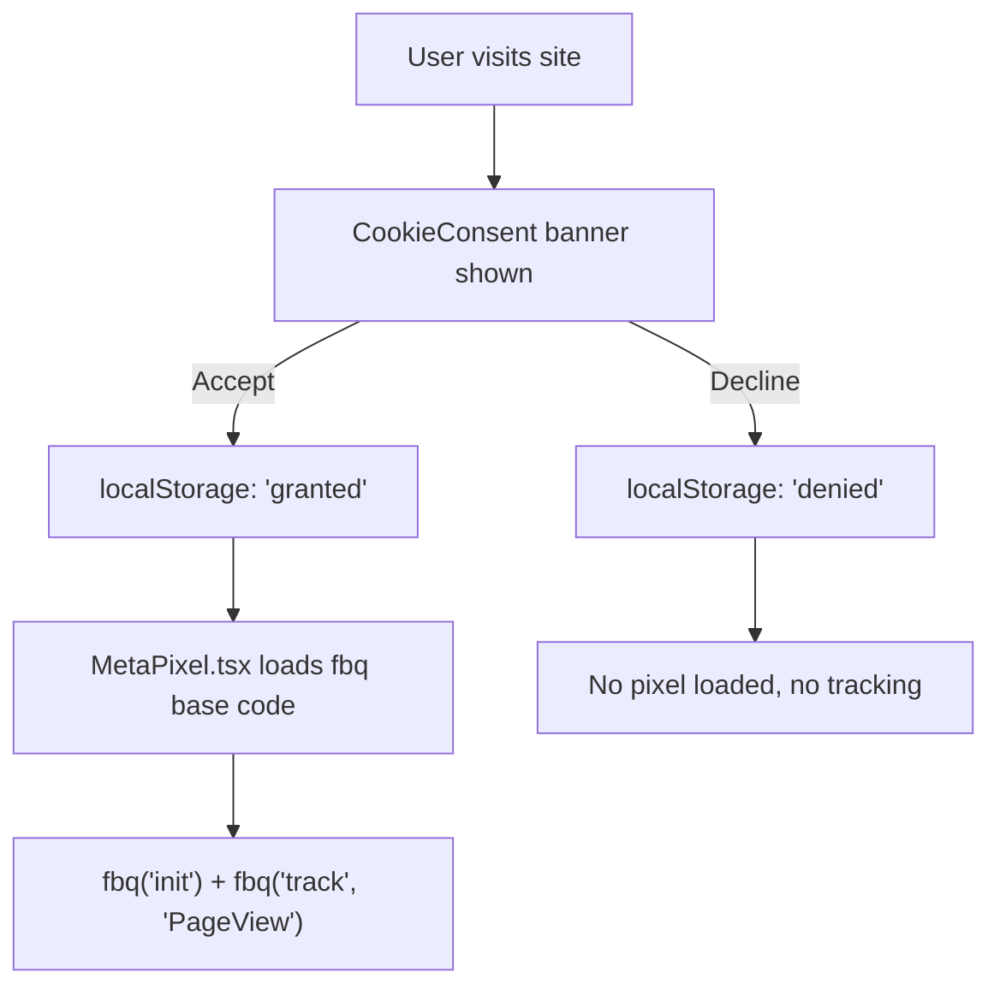
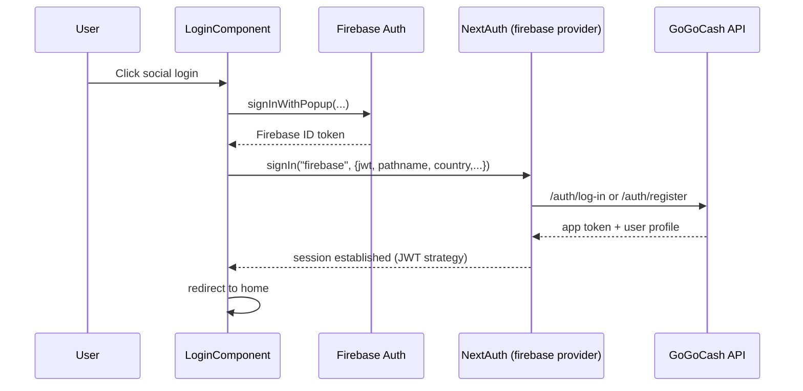

# GoGoCash Web App (Feature: Firebase Login)

This repository contains the GoGoCash frontend built with Next.js App Router. It is a client-heavy application focused on cashback discovery, user profile management, referral and quest features, and wallet withdrawal flows (bank transfer + Web3).

## Quick Start

1. Copy `.env.example` to `.env.local`.
2. Install dependencies with `npm install`.
3. Run the app with `npm run dev`.
4. Make sure the backend repo is running at the URL in `NEXT_PUBLIC_API_URL`.
5. Open `http://localhost:3000/en`.

## Firebase App Hosting (staging)

- **Full release (lint, test, production build, preflight, deploy):** `npm run deploy:firebase:release`
- **Upload only** (after you already built): `npm run deploy:firebase`
- **Console env template** (keys to paste in App Hosting): `firebase-console.staging.env.example`
- **Details:** `AGENTS.md` → section _Firebase App Hosting (staging / UAT)_

## Related Repositories

- `../gogocash_api-feature-login-firebase`: backend contract source of truth for auth, offers, profile, wallet, withdrawals, quests, and referrals.
- `../gogocash_admin-main`: internal dashboard that shares some API contracts but not the customer-facing routing or auth UX.

## AI Handoff

- Read these files first: `src/app/layout.tsx`, `src/providers/ProviderDefault.tsx`, `src/lib/axios/client.ts`, `src/lib/authFirebase.ts`, `src/features/auth/component/LoginComponent.tsx`.
- **Analytics / Meta Pixel**: tracking lives in `src/lib/metaPixel.ts` (event helpers) and `src/components/analytics/MetaPixel.tsx` (base code loader). Cookie consent is handled by `src/hooks/useConsent.ts` + `src/components/consent/CookieConsent.tsx`. All `fbq()` calls are consent-gated — the pixel only loads after the user accepts. See section 3.7 below for full details.
- Auth is Firebase-based via NextAuth (`src/lib/authFirebase.ts`). Session-wide helpers (logout, withdraw-check query) live in `src/providers/SessionContext.tsx`.
- Most features are client components backed by React Query and thin Axios services. If the API shape changes, update typings, query hooks, and UI consumers together.
- Browser verification matters for auth callbacks, analytics, GTM, metadata, and favicon changes. Do not stop at lint or build output for those areas.

## 1) Architecture At A Glance

### Core architecture decisions

- Framework: Next.js 16 (App Router) with TypeScript.
- Rendering style: mostly client components (`"use client"`) for fast UI interactivity and SDK compatibility.
- Data layer: `@tanstack/react-query` + Axios wrapper with centralized auth token injection.
- Auth session: NextAuth JWT strategy.
- Identity provider: Firebase-based credential flow (`provider id: firebase`) with Google/X/Facebook/Telegram entry points.
- i18n: `next-intl` route-based localization (`/en/*`, `/th/*`).
- Web3: `ethers` + MetaMask for on-chain withdrawal transactions.

### High-level runtime graph



## 2) Repository Structure

```text
src/
  app/
    layout.tsx                     # Root HTML shell + ProviderDefault
    [locale]/
      layout.tsx                   # Locale shell + ClientLayoutWrapper
      page.tsx                     # Home
      login/page.tsx
      register/page.tsx
      quest/page.tsx
      shop/page.tsx
      shop/[id]/page.tsx
      category/page.tsx
      category/[name]/page.tsx
      auth/callback/page.tsx       # Telegram/Firebase callback bridge
      (profile)/                   # Auth-protected profile area
        layout.tsx                 # AuthGuard + profile sidebar layout
        profile/*
        wallet/page.tsx
        withdraw/*
        method/*
        favorite/page.tsx
        subscription/page.tsx
    api/
      auth/[...nextauth]/route.ts  # NextAuth endpoint
      countries/route.ts           # REST Countries proxy
      hello/route.ts               # health/demo endpoint

  components/
    analytics/
      GoogleTagManager.tsx         # GTM + GA4 script injection
      MetaPixel.tsx                # Meta Pixel base code (consent-gated)
      MerchantListTracker.tsx      # GA4 merchant list view tracking
      RouteAnalyticsTracker.tsx    # GA4 page view tracking
    consent/
      CookieConsent.tsx            # PDPA cookie consent banner
    layouts/                       # Header/SubHeader/Footer/Profile shell
    auth/                          # Auth guards
    common/                        # Generic UI elements
    icons/

  features/
    auth/ home/ shop/ category/ search/
    profile/ wallet/ transaction/
    quest/ referral/ subscription/

  hooks/
    useFirebaseLogin.ts
    useConsent.ts                  # Cookie consent state (localStorage)
    useWithdrawWeb3.ts
    useWithdrawMyCashback.ts

  lib/
    analytics.ts                   # GA4/GTM event helpers
    metaPixel.ts                   # Meta Pixel fbq() helpers (consent-gated)
    axios/client.ts                # HTTP client + auth interceptors
    authFirebase.ts                # NextAuth config
    firebaseClient.ts              # Firebase browser setup
    query/queryClient.ts           # React Query defaults
    services/*.ts                  # Domain API wrappers

  i18n/
    routing.ts navigation.ts request.ts

  interfaces/
    auth.ts offer.ts withdraw.ts ...

  messages/
    en.json th.json jp.json
```

## 3) Runtime Layers In Detail

## 3.1 App Router and Layout Composition

### Root layout

- File: `src/app/layout.tsx`
- Responsibilities:
  - Sets metadata and global CSS.
  - Wraps all pages with `ProviderDefault`.
  - Injects Facebook domain verification meta tag.

### Locale layout

- File: `src/app/[locale]/layout.tsx`
- Responsibilities:
  - Wraps locale routes in `NextIntlClientProvider`.
  - Wraps visible app frame in `ClientLayoutWrapper`.

### Profile route-group layout

- File: `src/app/[locale]/(profile)/layout.tsx`
- Responsibilities:
  - Uses `AuthGuard` to protect profile routes.
  - Applies profile sidebar shell (`SubProfile`).

### Layout gating behavior

- `ClientLayoutWrapper` always paints header/main/footer immediately (no SDK-readiness gate).

## 3.2 Global Provider Stack

File: `src/providers/ProviderDefault.tsx`

Provider order:

1. `QueryClientProvider`
2. `ThemeProvider` (MUI) + `CssBaseline`
3. `SessionProvider` (NextAuth)
4. `PostHogProvider`
5. `SessionContextProvider` (session, signOutAuth, withdraw-check query)
6. `Toaster`
7. `ReactQueryDevtools` (dev only)

Why this matters:

- Ensures one place controls React Query, auth session, and shared session-derived queries.

## 3.3 Authentication Architecture

### Active NextAuth configuration

- Route: `src/app/api/auth/[...nextauth]/route.ts`
- Active options file: `src/lib/authFirebase.ts`

### Provider and credential flow

- NextAuth credential provider id: `firebase`.
- Supported branches in `authorize`:
  - `type === "telegram"`: reads `/user/profile` with provided JWT.
  - Default Firebase social flow:
    - If pathname is `/register` -> calls `/auth/register`.
    - Else -> calls `/auth/log-in`.

### Session/JWT callbacks

- Token stores app-specific identity fields (`_id`, `wallet`, `username`, region/mobile/birthdate/gender, etc.).
- Session maps token fields to `session.user`.
- Session strategy: JWT.

### Frontend login entry points

- `src/features/auth/component/LoginComponent.tsx`
  - Social login buttons use `useFirebaseLogin` for Google/X/Facebook.
  - Telegram OAuth handled via Telegram redirect + callback params.
  - Final sign-in always enters NextAuth through `signIn("firebase", ...)`.

### Axios auth propagation

- File: `src/lib/axios/client.ts`
- Request interceptor:
  - Reads current session with `getSession()`.
  - Adds `Authorization: Bearer <session.user.access_token>`.
- Response interceptor:
  - Auto-signout on token-invalid messages (Firebase token invalid/expired, bad algorithm).

## 3.4 Data Access Layer

### React Query

- Centralized query client in `src/lib/query/queryClient.ts`.
- Defaults:
  - `refetchOnWindowFocus: false`
  - `refetchOnMount: false`
  - `refetchOnReconnect: false`
  - `staleTime: 0`

### HTTP helpers

- `fetcher` -> GET
- `fetcherPost` -> POST
- `fetcherPut` -> PUT

These wrappers are used directly in feature components and hook-level queries/mutations.

### Service wrappers

- `src/lib/services/auth.ts`
- `src/lib/services/detail.ts`
- `src/lib/services/offer.ts`
- `src/lib/services/withdraw.ts`

Pattern: thin endpoint wrappers around the shared Axios client.

## 3.5 Internationalization Layer

Files:

- `proxy.ts` (root; Next.js 16 + next-intl — replaces former `middleware.ts`)
- `src/i18n/routing.ts`
- `src/i18n/navigation.ts`
- `src/i18n/request.ts`
- `src/messages/en.json`, `src/messages/th.json`

Behavior:

- Locale-prefixed routing enabled via `next-intl` `createMiddleware` in `proxy.ts`.
- Active locales in routing: `en`, `th` (default `en` in `src/i18n/routing.ts`).
- Message bundles loaded dynamically from `src/messages/{locale}.json`.

Note:

- `next-intl.config.ts` currently uses a different default locale (`th`) from `src/i18n/routing.ts` (`en`). Keep these aligned to avoid locale drift.

## 3.6 UI/Layout Layer

### Global navigation

- `Header.tsx`: logo, search, category popup, profile bar, locale/country modal.
- `SubHeader.tsx`: quick category links + help link behavior by user region.
- `Footer.tsx` / `FooterMobile.tsx`: desktop/mobile bottom navigation and links.

### Route-protected profile shell

- `SubProfile.tsx` renders left navigation for profile-related pages.
- `AuthGuard.tsx` redirects unauthenticated users to `/login`.

## 3.7 Analytics & Meta Pixel

### Architecture overview

The app has two parallel analytics layers:

1. **GA4 / GTM**: existing — fires via `src/lib/analytics.ts` → `window.dataLayer` → `window.gtag`.
2. **Meta Pixel**: new — fires via `src/lib/metaPixel.ts` → `window.fbq`.

Both layers are gated behind `NEXT_PUBLIC_ANALYTICS_ENABLED`. The Meta Pixel is additionally gated behind **cookie consent** (PDPA compliance).

### Consent flow



### Meta Pixel event map

| PRD Req | Event                  | Type     | Trigger location                                | Parameters                                                             |
| ------- | ---------------------- | -------- | ----------------------------------------------- | ---------------------------------------------------------------------- |
| REQ-002 | `ViewContent`          | Standard | `ShopDetail.tsx` on mount                       | `content_name`, `content_category`, `content_ids`, `value`, `currency` |
| REQ-003 | `CompleteRegistration` | Standard | `useFirebaseLogin.ts` on successful `/register` | `status: true`                                                         |
| REQ-004 | `InitiateCheckout`     | Standard | `ShopDetail.tsx` → `openLinkOffer()`            | —                                                                      |
| REQ-005 | `Purchase`             | Standard | `WithdrawMyCashback.tsx` (crypto + bank)        | `value`, `currency`                                                    |
| REQ-006 | `QuestStarted`         | Custom   | `MissionList.tsx` on task click                 | —                                                                      |

### Key files

| File                                            | Role                                                               |
| ----------------------------------------------- | ------------------------------------------------------------------ |
| `src/lib/metaPixel.ts`                          | Type-safe `fbq()` wrappers, consent checks, debug logging          |
| `src/components/analytics/MetaPixel.tsx`        | Loads pixel base code `<script>` after consent                     |
| `src/hooks/useConsent.ts`                       | Cookie consent state hook (localStorage `gogocash_cookie_consent`) |
| `src/components/consent/CookieConsent.tsx`      | PDPA consent banner UI                                             |
| `src/lib/analytics.ts`                          | GA4/GTM event helpers (existing)                                   |
| `src/components/analytics/GoogleTagManager.tsx` | GTM/GA4 script loader (existing)                                   |

### Security: No PII

All `fbq()` calls transmit only: merchant names, offer/merchant IDs, cashback amounts, currency codes, and boolean flags. **No email, phone, wallet address, or user identifier is ever sent to Meta.**

### Custom audiences (manual)

These audiences should be created in **Meta Events Manager → Audiences**:

- All Visitors (30 days)
- ViewContent viewers (14 days)
- InitiateCheckout but NOT Purchase (7 days)
- Purchasers — exclusion list (180 days)
- Registered Users (30 days)

## 4) Feature Modules (What Owns What)

| Module         | Main responsibility                                                     | Key files                                                                         |
| -------------- | ----------------------------------------------------------------------- | --------------------------------------------------------------------------------- |
| `auth`         | Login/register UI, Telegram + Firebase social entry points              | `src/features/auth/component/LoginComponent.tsx`, `src/hooks/useFirebaseLogin.ts` |
| `home`         | Landing sections (banner, trending, popular, special categories)        | `src/features/home/component/*`                                                   |
| `shop`         | Offer list, offer detail, deeplink generation, coupons, favorites       | `src/features/shop/component/List.tsx`, `ShopDetail.tsx`                          |
| `category`     | Category index and category-specific offer listing                      | `src/features/category/component/*`                                               |
| `search`       | Header search popper with offer lookup                                  | `src/features/search/component/SearchShop.tsx`                                    |
| `profile`      | User profile info, phone verification, payout methods, favorites/offers | `src/features/profile/component/*`                                                |
| `wallet`       | Withdraw UI and method selection                                        | `src/features/wallet/component/MyWalletWithdraw.tsx`                              |
| `transaction`  | Wallet summary, conversion list, withdraw history                       | `src/features/transaction/component/WalletTransaction.tsx`                        |
| `quest`        | Ranking, extra-point offers, quest-related shop list                    | `src/features/quest/component/QuestPage.tsx`                                      |
| `referral`     | Referral link sharing and referral activity listing                     | `src/features/referral/ReferralPage.tsx`                                          |
| `subscription` | Subscription placeholder (Stripe link or "unavailable" fallback)        | `src/features/subscription/SubscriptionPage.tsx`                                  |

## 5) API Surface Used By Frontend

Most API calls hit `${NEXT_PUBLIC_API_URL}` via Axios wrappers.

### Auth / user

- `POST /auth/log-in`
- `POST /auth/register`
- `POST /auth/log-in/telegram`
- `GET /auth/check-account-telegram/:telegramId`
- `GET /user/profile`
- `PUT /user/profile`
- `PUT /user/update-country`
- `POST /auth/firebase` (phone verification flow)

### Offers / discovery

- `GET /offer/banner-home`
- `GET /offer/extra`
- `GET /offer/extra-point`
- `GET /offer?category=...&search=...&limit=...&page=...`
- `GET /offer/:id`
- `GET /offer/get-coupon-id/:id`
- `GET /offer/get-category/list`
- `GET /offer/favorite/:page/:limit`
- `POST /offer/favorite/:offer_id`
- `POST /involve/create-affiliate`

### Wallet / withdraw

- `POST /withdraw/check`
- `POST /withdraw/check-my-cashback`
- `POST /withdraw/list-check`
- `GET /withdraw?search=&limit=&page=`
- `POST /withdraw/signature`
- `POST /withdraw`
- `POST /withdraw/bank-transfer`
- `GET /withdraw/methods-list`
- `GET /withdraw/methods/:id`
- `POST /withdraw/methods`
- `PATCH /withdraw/methods/:id`
- `GET /withdraw/banks`

### Quest / referral / points

- `GET /point/check-points/:start/:end`
- `GET /point/my-quest-list/:start/:end`
- `GET /point/referral-list`

### Internal Next.js API routes

- `GET /api/countries` -> proxies REST Countries and sorts by common name.
- `GET /api/hello` -> simple text response.

## 6) Critical User Flows

### 6.1 Login Flow (Google/X/Facebook)



### 6.2 Protected Profile Route Flow

1. User navigates to any route in `src/app/[locale]/(profile)/*`.
2. `AuthGuard` reads `useSession()` status.
3. If unauthenticated -> redirect `/login`.
4. If authenticated -> render profile layout + route content.

### 6.3 Web3 Withdraw Flow

1. Load withdraw summary from `/withdraw/check`.
2. Ensure wallet is connected (MetaMask) and on selected chain.
3. Request backend signature: `POST /withdraw/signature`.
4. Execute on-chain `withdrawCashback(...)` using chain-specific ABI/address.
5. On success, persist withdraw history with `POST /withdraw`.
6. Refresh wallet/check state.

## 7) Environment Variables

Copy `.env.example` to `.env.local` before running the app locally.

## Required for local development

| Variable                              | Purpose                                                                                |
| ------------------------------------- | -------------------------------------------------------------------------------------- |
| `NEXT_PUBLIC_API_URL`                 | Base URL for backend API used by Axios client                                          |
| `NEXTAUTH_SECRET`                     | NextAuth JWT/session signing secret                                                    |
| `NEXT_PUBLIC_ANALYTICS_ENABLED`       | Kill switch for GTM/GA4/Meta tracking                                                  |
| `NEXT_PUBLIC_GTM_ID`                  | Google Tag Manager container ID                                                        |
| `NEXT_PUBLIC_GA_MEASUREMENT_ID`       | GA4 property ID used by GTM and direct config fallback                                 |
| `NEXT_PUBLIC_FIREBASE_API_KEY`        | Firebase client SDK                                                                    |
| `NEXT_PUBLIC_FIREBASE_AUTH_DOMAIN`    | Firebase client SDK                                                                    |
| `NEXT_PUBLIC_FIREBASE_PROJECT_ID`     | Firebase client SDK                                                                    |
| `NEXT_PUBLIC_FIREBASE_APP_ID`         | Firebase client SDK                                                                    |
| `NEXT_PUBLIC_FRONTEND_URL`            | Used in Telegram/referral links and redirects                                          |
| `NEXT_PUBLIC_TELEGRAM_BOT_TOKEN`      | Telegram OAuth flow (`LoginComponent`)                                                 |
| `NEXT_PUBLIC_TELEGRAM_BOT_USERNAME`   | Telegram widget (`TelegramLogin`)                                                      |
| `NEXT_PUBLIC_META_PIXEL_ID`           | Meta Pixel ID (default: `207487147928890`). Used by `MetaPixel.tsx` and `metaPixel.ts` |
| `NEXT_PUBLIC_META_USER_SALT`          | Salt for hashing user identifiers before analytics dispatch                            |
| `NEXT_PUBLIC_ANALYTICS_DEBUG`         | Enables verbose console logging for analytics + Meta Pixel events                      |

## Required for Web3 withdrawal

| Variable                                        | Purpose                  |
| ----------------------------------------------- | ------------------------ |
| `NEXT_PUBLIC_CHAIN_ID_WITHDRAW_POLYGON`         | Polygon chain id         |
| `NEXT_PUBLIC_CHAIN_ID_WITHDRAW_BNB`             | BNB chain id             |
| `NEXT_PUBLIC_CHAIN_ID_WITHDRAW_SONIC`           | Sonic chain id           |
| `NEXT_PUBLIC_CHAIN_ID_WITHDRAW_CELO`            | Celo chain id            |
| `NEXT_PUBLIC_CONTRACT_WITHDRAW_ADDRESS_POLYGON` | Polygon contract address |
| `NEXT_PUBLIC_CONTRACT_WITHDRAW_ADDRESS_BNB`     | BNB contract address     |
| `NEXT_PUBLIC_CONTRACT_WITHDRAW_ADDRESS_SONIC`   | Sonic contract address   |
| `NEXT_PUBLIC_CONTRACT_WITHDRAW_ADDRESS_CELO`    | Celo contract address    |

## 8) Local Development

### Install

```bash
cp .env.example .env.local
npm install
```

### Run

```bash
npm run dev
```

### Lint

```bash
npm run lint
```

### Build and start

```bash
npm run build
npm run start
```

## 9) Docker Notes

Current `Dockerfile` uses a multi-stage build:

- Builder installs dependencies and runs `yarn build`.
- Runner starts app via `npm start`.

Make sure lockfile/package manager strategy is consistent in CI/CD (current file mixes `yarn` and `npm` commands).

## 10) Development Playbook (How To Add Features Fast)

1. Add route under `src/app/[locale]/...`.
2. Implement domain UI under `src/features/<domain>/component`.
3. Add/extend TypeScript interfaces in `src/interfaces`.
4. Add API calls using `fetcher`/`fetcherPost`/services in `src/lib/services`.
5. Use React Query for server state and cache keys scoped by domain.
6. If route requires login, place it under `(profile)` or add `AuthGuard`.
7. Add translation keys in `src/messages/en.json` and `src/messages/th.json`.
8. Keep locale routing config consistent across `src/i18n/*` and `next-intl.config.ts`.

## 11) Technical Notes / Caveats

- Quest API date range in `QuestPage` is currently hardcoded (`2026-02-01` to `2026-02-28`).
- Locale config defaults differ between `src/i18n/routing.ts` and `next-intl.config.ts`.
- `src/messages/jp.json` exists but `jp` is not included in active locale routing.

## 12) Quick File Index For New Contributors

- Provider stack: `src/providers/ProviderDefault.tsx`
- Auth config: `src/lib/authFirebase.ts`
- API client/interceptors: `src/lib/axios/client.ts`
- Firebase browser auth: `src/lib/firebaseClient.ts`
- Session context (logout, withdraw-check query): `src/providers/SessionContext.tsx`
- Protected layout: `src/app/[locale]/(profile)/layout.tsx`
- Login entry: `src/features/auth/component/LoginComponent.tsx`
- Withdraw hook (Web3): `src/hooks/useWithdrawWeb3.ts`
- Withdraw UI: `src/features/wallet/component/MyWalletWithdraw.tsx`
- Transaction/history UI: `src/features/transaction/component/WalletTransaction.tsx`
- i18n routing: `src/i18n/routing.ts`
- **GA4/GTM analytics**: `src/lib/analytics.ts`, `src/components/analytics/GoogleTagManager.tsx`
- **Meta Pixel tracking**: `src/lib/metaPixel.ts`, `src/components/analytics/MetaPixel.tsx`
- **Cookie consent**: `src/hooks/useConsent.ts`, `src/components/consent/CookieConsent.tsx`
