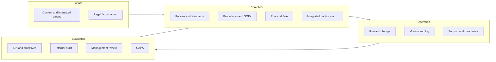

# Integrated Management System Overview

| Field | Value |
| --- | --- |
| **Document title** | Integrated Management System (IMS) Overview |
| **Document ID** | IMS-001 |
| **Version** | 0.1 |
| **Artifact type** | Policy / record |
| **Owner** | CEO / Founder |
| **Approver** | CEO / Founder |
| **Effective date** | TBD |
| **Review date** | +12 months |
| **Classification** | Internal — Confidential |

---

## Purpose

Describe **how** GoGoCash’s **single** IMS combines **quality (ISO 9001)** and **information security (ISO 27001:2022)** with **SOC 2 Type II** readiness, including **process interactions** and **document architecture**.

---

## Scope

Covers design, delivery, operation, and improvement of the GoGoCash digital platform (web, LINE Mini App, admin, cashback logic, merchant operations) and supporting functions (engineering, ops, support).

---

## Roles and responsibilities

| Function | IMS role |
| --- | --- |
| Leadership | Sets direction, approves policy, resourcing, and scope. |
| Engineering | Secure SDLC, infrastructure, logging, backups, access implementation. |
| CS & Ops | Customer/merchant processes, complaints, vendor coordination, operational evidence. |
| All staff | Follow policies, complete training, report incidents. |

---

## IMS architecture (lean)

---

## Unified processes (cross-standard)

| Process | ISO 9001 | ISO 27001 | SOC 2 |
| --- | --- | --- | --- |
| Document control | 7.5 | 7.5 | CC2.1 |
| Risk treatment | 6.1 | 6.1.3 | CC3.x |
| Change / release | 8.5 | 8.32 | CC8.1 |
| Internal audit | 9.2 | 9.2 | CC4.2 |
| Management review | 9.3 | 9.3 | CC5.1 |
| Improvement / CAPA | 10.2 | 10.1 | CC7.5 |
| Supplier / vendor | 8.4 | 5.19–5.23 | CC9.2 |

---

## Procedure and policy statements

1. **One source of truth:** Controlled documents live under `compliance/` with IDs; `REPOSITORY_STRUCTURE.md` lists canonical paths.  
2. **Registers are live:** Risk, vendor, access, and evidence trackers are updated on a defined cadence (see each register header).  
3. **Security & quality together:** Security incidents that affect customers are also **service nonconformities**; CAPA may apply.  
4. **SOC 2 evidence:** Monthly checklist (`compliance/14-soc2/`) ties recurring artifacts to controls.  

---

## Records produced

- This overview (controlled).  
- Management review minutes referencing IMS health.  

---

## Related controls

GOV-001, GOV-003, MR-001, EVD-001  

---

## Related standards mapping

| Standard | Reference |
| --- | --- |
| ISO 9001 | 4.3, 4.4, 5.1 |
| ISO 27001:2022 | 4.3, 4.4, 5.1 |
| SOC 2 | CC1.x, CC2.1 |
