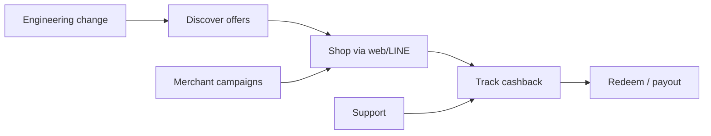

# ISO 9001 — Lightweight QMS Model (GoGoCash / Notion)

**Artifact type:** Record  

---

## Context of the organization

| Element | GoGoCash content |
| --- | --- |
| Market | Thailand cashback / LINE commerce |
| Strategic direction | Growth with trust and PDPA compliance |
| Capabilities | Small product+engineering+ops team |

**Notion:** `CTX-001` page + **Interested parties** table on ISO 9001 Program page.

---

## Interested parties

| Party | Need | QMS response |
| --- | --- | --- |
| Customers | Accurate cashback, support | Complaints DB, KPIs |
| Merchants | Fair onboarding | SOP merchant, KPI |
| Regulators | Lawful processing | Policies, RoPA |
| Team | Clear process | Procedures library |

---

## Quality policy

**Document:** `POL-QMS-001` (mirror: `notion/documents/` draft) — commitments: customer focus, evidence-based improvement, secure reliable service.

---

## Quality objectives (examples)

| Objective | KPI | Owner |
| --- | --- | --- |
| Reliable cashback crediting | Dispute rate, recon accuracy | Eng Lead |
| Responsive support | First response SLA | CS Ops |
| On-time merchant setup | Onboarding SLA | CS Ops |

**Notion:** **KPIs** database linked to **Management Reviews**.

---

## Process map (digital services)

**Owners:** Product/Design (UX); Eng (platform); CS Ops (service).

---

## Customer complaint handling

**Complaints** DB → categorize → resolve → trend → **CAPA** if repeat.  
**Procedure:** `PROC-SUPPORT-COMPLAINT` (draft in documents bundle).

---

## Nonconforming outputs

Service errors (wrong cashback, bad deploy) → **Nonconformities** DB; disposition: fix forward, notify if customer impact.

---

## Corrective action

**CAPAs** DB — sources: complaints, NC, audits, incidents.

---

## Internal audit

**Audits** DB type internal — lean checklist against Controls.

---

## Management review

**Management Reviews** DB — inputs: KPIs, risks, incidents, CAPAs, findings.

---

## Continual improvement

**CAPA + KPI trends + MR actions** — Notion **Tasks** for actions.

---

## Multi-standard note

Same **MR** and **CAPA** objects satisfy ISO 27001 **9.3** and **10.1** and SOC 2 oversight when evidenced.

---

## Related

`compliance/16-iso9001/` (when populated), `03-TOP-LEVEL-PAGES.md` ISO 9001 Program  
