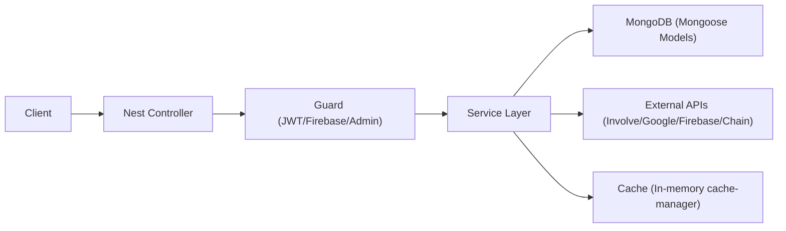
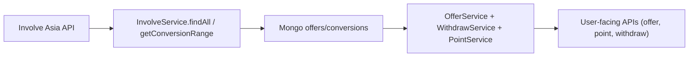

# GoGoCash API (NestJS)

Backend API for GoGoCash affiliate cashback, points, withdrawals, admin operations, Google Drive media storage, transactional email (Resend), and Telegram bot authentication.

## Quick Start

1. Copy `.env.example` to `.env`.
2. Install dependencies with `yarn install`.
3. Run the API with `yarn start:dev`.
4. Confirm the server at `http://localhost:8080` and Swagger at `http://localhost:8080/doc_68bf99fed9667685c1637607`.
5. When using the admin dashboard against this local API (not mock auth), seed a superadmin: `npm run seed:local-admin -- --email you@example.com --password your-password --username you` (defaults: `admin@gogocash.co` / `1234` / `admin`; local MongoDB only unless `--force`).

## Connected Workspaces

This API lives in the `gogocash-monorepo` Turborepo alongside the apps that consume it:

- `../app`: customer-facing Expo / React Native (web) app (`@gogocash/mobile`) consuming auth, offer, profile, wallet, and quest APIs.
- `../admin`: internal Next.js dashboard consuming admin auth, moderation, reporting, and operational endpoints.

## AI Handoff

- Read these files first: `src/app.module.ts`, `src/auth/auth.service.ts`, `src/involve/involve.service.ts`, `src/withdraw/withdraw.service.ts`.
- This repo is the contract source of truth. If you change controller response shapes, update both the `app` (Expo) and `admin` (Next.js) workspaces in the same task.
- Legacy env names still exist, especially `INVOLVE_SECRET` and `INVOVLE_SECRET`. Keep both wired until the code is normalized.
- Withdrawal, point, and conversion logic cross module boundaries. Search both controllers and services before changing finance behavior.
- Product analytics now live in this repo too. Read `src/analytics/*`, `src/auth/auth.controller.ts`, and `src/withdraw/cronjob/job.service.ts` before touching PostHog events, headers, or flags.

## Change Map

| If you need to change... | Start here | Then check |
| --- | --- | --- |
| User login/register response fields or JWT/session contract | `src/auth/auth.service.ts`, `src/auth/auth.controller.ts` | customer web app NextAuth wiring and admin login only if admin payload changed |
| Customer PostHog truth events or feature-flag evaluation | `src/analytics/*` plus the owning business service | the customer app analytics runtime |
| Deeplink generation, conversions, points, withdrawals | owning domain service first (`involve`, `withdraw`, `point`) | `app` and `admin` workspaces if DTOs or UI labels changed |
| CORS or request correlation headers | `src/main.ts`, `src/analytics/analytics-context.ts` | customer app Axios/auth callers |
| Admin-only operational behavior | `src/admin/*` | `apps/admin` tables/forms |

## 1. What This Service Does

This service is a **modular NestJS monolith** that handles:

- User authentication (Firebase, Telegram, LINE, email OTP, and MiniPay SIWE)
- User profile and MyCashback balance lookup
- Offer ingestion from Involve Asia and offer browsing
- Affiliate deeplink generation per user
- Conversion synchronization and payout aggregation
- Point system (purchase, referral, ranking)
- Withdrawal flows (on-chain + bank transfer)
- Admin dashboard operations (fees, conversion, banners, offer assets)
- Telegram bot and web verification handoff

## Current Implementation Status

- Customer auth success responses include `is_new_user` and `auth_flow`.
- The API accepts `X-PostHog-Distinct-Id`, `X-PostHog-Anonymous-Id`, and `X-App-Locale` from the customer web app.
- PostHog truth events are currently wired for auth, deeplink generation, conversion sync/status, points, withdraw creation/completion/rejection, and withdraw method creation.
- The admin dashboard consumes this API but is not part of the customer PostHog project.

### Security hardening (2026-06-14)

A money/auth hardening pass landed — see [`/SECURITY_HARDENING.md`](../../SECURITY_HARDENING.md) for the full register and follow-up issues:

- **Global `ValidationPipe`** in `main.ts` (`transform` + `forbidUnknownValues:false`; whitelist deferred → #46) — class-validator decorators are now actually enforced.
- **Withdraw balance gate** on `POST /withdraw` + `/withdraw/bank-transfer` (`assertWithinBalance`); `create()` no longer self-approves from a client `tx_hash` (now `pending` + admin `PATCH /withdraw/:id/approve`).
- **Bank-transfer concurrency** serialized in a per-user Mongo transaction (closes the double-withdraw TOCTOU; on-chain `create()` reorder → #41).
- **Authz fixes:** withdraw-method IDOR scoped to owner; guarded the unauth cashback-balance route, the involve offer-mutation/`create-affiliate-ai` routes (the AI route via a fail-closed API key, `INVOLVE_AI_API_KEY`).
- **FX** conversion is cached + timeout-bounded + fail-closed (no more silent-null that zeroed foreign-currency balances).
- A real `checkWithdraw`↔Mongo integration test runs in CI (`test/withdraw-balance.e2e-spec.ts`).

### Quest task-v2 rollout (2026-07-18)

- `QUEST_TASK_V2_ENABLED=true` in Railway **dev AND staging** since 2026-07-18.
  **Not yet enabled in production.**
- Dev + staging Mongo are now authenticated single-node replica sets (`rs0`;
  mongo 8.0.4 dev / 8.3.4 staging) — transactions commit. This conversion is
  complete.
- All 18 `QUEST_TASK_V2_REQUIRED_INDEXES` plus the canonical fence doc
  `quest_source_config_fence` (`fence_key` `task-v2-source-config-v1`,
  revision 0) are in place on both envs.
- Index migration executed on both envs: `conversions.conversion_id_1` was
  `unique:true` (legacy); the task-v2 contract requires it NON-unique, so it
  was dropped and recreated non-unique. Identity uniqueness is now enforced
  by the partial composite unique index `uniq_conversion_provider_identity`
  on `(source, provider_account, provider_conversion_id)`. Staging pre-check
  found 0 duplicate identity groups across 2907 string-identity conversions
  (all `source=involve`).
- Legacy quest backfill + membership reconciliation were no-ops at rollout
  time (0 quests, 0 memberships, 0 membership tiers, 0 legacy reward
  manifests/resolution commands/social rewards on both envs).
- Exact-once acceptance passed 7/7 on BOTH envs on 2026-07-18:
  `friend_referral` (account_created) credited the referrer 100 pts;
  `spend_target` (THB) credited the buyer 200 pts; `brand_purchase`
  completed=true with 0 pts (progress-only by design); replaying the same
  conversion `source_event_id` credited ZERO additional points. GitHub issue
  #353 closed 2026-07-18 with acceptance evidence.
- Rollback: set `QUEST_TASK_V2_ENABLED=false` (the consumer no-ops
  instantly). The added indexes are harmless while disabled, BUT
  `conversion_id_1` must stay non-unique — the composite index now carries
  the identity-uniqueness guarantee.

## 2. Tech Stack

- **Framework**: NestJS
- **Runtime**: Node.js 26 (`engines.node >= 24`; Docker image `node:26-alpine`)
- **Language**: TypeScript
- **DB**: MongoDB via Mongoose (mongoose 9)
- **Scheduler**: `@nestjs/schedule` cron jobs
- **Auth**: backend JWT, Firebase Admin SDK, Telegram, LINE, email OTP, and MiniPay SIWE
- **External APIs**: Involve Asia, Google Drive API, ExchangeRate API
- **Bot**: Telegraf (`nestjs-telegraf`)
- **API Docs**: Swagger (`/doc_68bf99fed9667685c1637607`)

## 3. Project Structure

```text
src/
  main.ts                 # app bootstrap, CORS, Swagger, static files
  app.module.ts           # module wiring + Mongo + schedule
  analytics/              # PostHog service, request context extractor, flag wrapper
  config/env.config.ts    # env mapping

  auth/                   # user auth flows + guards
  user/                   # user profile + MyCashback aggregation
  involve/                # Involve Asia integration (offers/conversions/deeplinks)
  offer/                  # offer listing, favorites, categories, coupons, banners
  brand/                  # brand catalog
  point/                  # points + rankings + referral points
  withdraw/               # withdrawal checks, requests, methods, conversion sync cron
  admin/                  # admin auth + operational management APIs
  google-drive/           # upload/delete/proxy files
  telegram-bot/           # Telegram command/update handlers + auth verification pages
  email/                  # transactional email via Resend (no-op when RESEND_API_KEY unset)
  customer-billing/       # Stripe-based billing
  gototrack/              # GogoSense feature module
  policy/                 # policy module
  tasks/                  # admin break-glass HTTP triggers for scheduled jobs
  common/                 # shared utilities
  utils/helper.ts         # currency conversion + Thai bank metadata

test/
  app.e2e-spec.ts
  withdraw-balance.e2e-spec.ts   # real checkWithdraw <-> Mongo integration test (runs in CI)
```

## 4. Runtime Bootstrap and Request Lifecycle

### 4.1 Bootstrap (`main.ts`)

- Creates Nest Express app
- Registers `cookie-parser`
- Enables permissive CORS (`origin: '*'`)
- Mounts static assets from `uploads/`
- Registers Swagger with bearer auth at:
  - `GET /doc_68bf99fed9667685c1637607`
- Starts server on `PORT` (default `8080`)

### 4.2 App Composition (`app.module.ts`)

Core imports:

- `ScheduleModule.forRoot()`
- `ConfigModule.forRoot({ load: [envConfig] })`
- `MongooseModule.forRoot(process.env.MONGO_URI)`
- Platform modules: `AnalyticsModule`, `PolicyModule`, `GototrackModule`, `CustomerBillingModule`
- Domain modules: `AuthModule`, `AdminModule`, `UserModule`, `OfferModule`, `BrandModule`, `WithdrawModule`, `GoogleDriveModule`, `PointModule`, `InvolveModule`, `TasksModule`
- `TelegramBotModule` is registered conditionally — only when `TELEGRAM_BOT_TOKEN` is set and not `'PLACEHOLDER'`.

### 4.3 Request Flow Pattern



## 5. Environment Variables

Copy `.env.example` to `.env` and use it as the baseline for local or staging setup.

These are referenced in code and should be defined in `.env` for local/prod:

### 5.1 Core

- `PORT`
- `MONGO_URI`
- `JWT_SECRET`
- `JWT_ADMIN_SECRET`

### 5.2 Auth + Identity

- `FIREBASE_PROJECT_ID`
- `TELEGRAM_BOT_TOKEN`
- `WEB_APP_URL`
- `API_BASE_URL`

### 5.3 Product Analytics

- `POSTHOG_KEY`
- `POSTHOG_HOST`
- `POSTHOG_ENABLED`
- `POSTHOG_DEBUG`

### 5.4 Involve Asia

- `INVOLVE_SECRET`
- `INVOVLE_SECRET` (legacy/misspelled key used in code)
- `INVOVLE_SECRET_OLD`

### 5.5 Google Drive

- `GOOGLE_CLIENT_ID`
- `GOOGLE_CLIENT_SECRET`
- `GOOGLE_REDIRECT_URI`
- `GOOGLE_REFRESH_TOKEN`

### 5.5.1 Transactional Email (Resend)

- `RESEND_API_KEY` (when unset, the email provider degrades to a logged no-op)
- `MAIL_FROM`

> See `.env.example` for the full, authoritative list (includes Optimise, Stripe billing, and SIWE settings not enumerated here).

### 5.6 Withdrawal / On-chain

- `PRIVATE_KEY_WITHDRAW`
- `CHAIN_ID_WITHDRAW_POLYGON`
- `CHAIN_ID_WITHDRAW_BNB`
- `CHAIN_ID_WITHDRAW_SONIC`
- `CHAIN_ID_WITHDRAW_CELO`
- `RPC_URL_POLYGON`
- `RPC_URL_BNB`
- `RPC_URL_SONIC`
- `RPC_URL_CELO`
- `CONTRACT_WITHDRAW_ADDRESS_POLYGON`
- `CONTRACT_WITHDRAW_ADDRESS_BNB`
- `CONTRACT_WITHDRAW_ADDRESS_SONIC`
- `CONTRACT_WITHDRAW_ADDRESS_CELO`

### 5.7 Quest Task v2

- `QUEST_TASK_V2_ENABLED` — enables the quest task-v2 consumer. `true` on
  Railway dev + staging since 2026-07-18; NOT enabled in production. Setting
  it to `false` is the instant rollback path (consumer no-ops).

## 6. Security Architecture

## 6.1 Product Analytics Contract

- The web app forwards `X-PostHog-Distinct-Id`, `X-PostHog-Anonymous-Id`, and `X-App-Locale`.
- Auth success responses now include:
  - `is_new_user`
  - `auth_flow`
- Backend truth events are emitted only after successful business outcomes through `src/analytics/analytics.service.ts`.
- The event and flag contract is defined by `src/analytics/*` (the source of truth for this repo).

### 6.1 Guard Types

- `FirebaseAuthGuard`
  - Reads `Authorization: Bearer <token>`
  - Verifies token with `JWT_SECRET`
  - Injects `request.user = { ...decoded, sub: decoded.userId }`
- `AuthAdminGuard`
  - Verifies admin JWT with `JWT_ADMIN_SECRET`
- `CrossmintAuthGuard`
  - Retains the obsolete `/auth/sign-in` route as a fail-closed compatibility boundary
  - Always returns `401` before provider, token, or user lookup logic can run

### 6.2 Token Issuance

- User token issuance via `AuthService.generateToken()` with `JWT_SECRET`, expiry `1d`
- Admin token issuance via `UserAdminService.login()` with `JWT_ADMIN_SECRET`
- Telegram flow also generates JWT using `JwtService.sign()`

## 7. Data Model (Mongo Collections)

### 7.1 Identity and Users

- `users`
  - Identity fields: `id_firebase` (unique), `id_telegram`, and historical
    `id_crossmint` values retained only for existing-record compatibility
  - Profile fields: `email`, `username`, `mobile`, `country`, `provider`, `disabled`
- `useradmins`
  - `email` (unique), `username`, `password` (bcrypt hash)
- `usermycashbacks`
  - External MyCashback account mirror with multi-currency `balance[]` and metadata

### 7.2 Affiliate/Offer Domain

- `offers`
  - Involve offer mirror (`offer_id`, `merchant_id`, commission fields)
  - CMS-ish fields (`banner`, `logo_*`, `offer_name_display`, `extra_point`, `disabled`)
- `categories`
- `coupons`
- `favoriteoffers`
- `banners` (home banner images/links)
- `deeplinks`
  - Per-user deeplink for `(offer_id, merchant_id, user_id)`

### 7.3 Conversion/Finance Domain

- `conversions`
  - Involve conversion mirror looked up by `conversion_id` (the
    `conversion_id_1` index is intentionally NON-unique since the 2026-07-18
    task-v2 migration; identity uniqueness is enforced by the partial
    composite unique index `uniq_conversion_provider_identity` on
    `(source, provider_account, provider_conversion_id)` — do not re-add
    uniqueness to `conversion_id_1`)
  - Includes `aff_sub1` (e.g. `user_id:<mongoId>`), `currency`, `payout`, `status`
- `feerates`
  - Global system fee and minimum withdrawal rules
- `withdraws`
  - Withdrawal records, conversion IDs, method info, tx hashes, status
- `withdrawmethods`
  - Stored bank account options per user
- `points`
  - Point ledger (`add/remove`, `action`, `conversion_id`, optional referral link)

## 8. Module-by-Module Deep Dive

### 8.1 Auth Module (`src/auth`)

**Responsibility**: login/register token issuance, Firebase phone binding, Telegram sign-in.

Key files:

- `auth.controller.ts`
- `auth.service.ts`
- `jwt-auth.guard.ts` (fail-closed retired-auth compatibility guard)
- `firebase-auth.guard.ts` (JWT user guard)
- `firebase-admin.provider.ts`

Important endpoints:

- `POST /auth/sign-in` (retired compatibility route; always returns `401`)
- `POST /auth/log-in` (Firebase token based)
- `POST /auth/register`
- `POST /auth/log-in/telegram`
- `GET /auth/check-account-telegram/:id`
- `POST /auth/firebase` (phone verification/update)
- `POST /auth/log-in/ai`

Core behavior:

- `signInFirebase()` verifies Firebase ID token using Admin SDK, then upserts user, returns app JWT.
- `signInTelegram()` maps Telegram identity into `users`, creates app JWT.
- Referral bonus trigger occurs on first sign-in if `referral_id` is provided and valid.
- `verifyPhone()` binds mobile from verified Firebase phone token and enforces uniqueness.

---

### 8.2 User Module (`src/user`)

**Responsibility**: user CRUD/profile and MyCashback aggregation.

Key files:

- `user.controller.ts`
- `user.service.ts`

Important endpoints:

- `PUT /user/update-country`
- `GET /user/profile`
- `PUT /user/profile`
- `GET /user` (admin guarded)
- `GET /user/balance/me/mycashback`
- `GET /user/balance/me/mycashback/admin/:id`

Core behavior:

- `getBalanceMyCashback()` resolves user’s MyCashback accounts by mobile/email matching and aggregates balances per currency.
- Handles Thai mobile normalization (`+66` to `0...`) during matching.

---

### 8.3 Involve Module (`src/involve`)

**Responsibility**: Involve Asia token auth, offer sync, deeplink generation, conversion retrieval.

Key files:

- `involve.service.ts`
- `involve.controller.ts`

Important endpoints:

- `GET /involve` (admin, full offer sync)
- `GET /involve/checkOfferDuplicate`
- `POST /involve/create-affiliate`
- `POST /involve/create-affiliate-ai/:email`
- `POST /involve/conversion/:offer_id`
- `POST /involve/conversion-all`

Core behavior:

- Auth token is cached in `cache-manager` (`access_token_involve`).
- `findAll()` pulls paginated offers from Involve and upserts into `offers`.
- Offers missing from latest sync are marked `{ type: 'old', disabled: true }`.
- `createAffiliate*()` ensures per-user deeplink uniqueness by `(offer_id, merchant_id, user_id)`.
- `getConversationAllPage()` uses local `conversions` collection and computes approved/pending totals in USD/THB with fee cap logic.

---

### 8.4 Offer Module (`src/offer`)

**Responsibility**: offer browsing, category listing, favorites, coupons, banner retrieval.

Key files:

- `offer.controller.ts`
- `offer.service.ts`
- `tasksService.ts` (monthly cron trigger)

Important endpoints:

- `GET /offer` (public listing with filters)
- `GET /offer/admin` (admin-optimized listing)
- `GET /offer/extra` and `/offer/extra-point`
- `GET /offer/get-category/list`
- `POST /offer/my-offers` (auth)
- `POST /offer/favorite/:offerId` and `GET /offer/favorite/:page/:limit`
- Coupon endpoints: `/offer/get-coupon`, `/offer/get-coupon-id/:offerId`, `/offer/update-coupon`

Core behavior:

- Supports search/category/country filtering and pagination.
- Non-admin listing excludes `disabled: true`.
- Favorite endpoint is toggle-style (create/remove).
- Coupon updates support both create and update based on presence of `id`.

---

### 8.5 Point Module (`src/point`)

**Responsibility**: point ledger and ranking/quest logic.

Key files:

- `point.controller.ts`
- `point.service.ts`
- `tasksService.ts` (daily cron)

Important endpoints:

- `GET /point` (my point balance)
- `GET /point/referral-list`
- `GET /point/quest-list/:startDate/:endDate`
- `GET /point/my-quest-list/:startDate/:endDate`

Core behavior:

- `addPointsToUser()` prevents duplicate purchase-point inserts by `(user_id, conversion_id, type:add, action:purchase)`.
- Ranking logic supports:
  - conversion-based ranking (`getQuestRankList`)
  - ledger-based ranking (`getQuestRankListOfPoint`)
- Extra ranking rules include:
  - merchant bonus (`offer.extra_point > 1`)
  - referral bonus
  - +50 bonus when points >= 300 during period

---

### 8.6 Withdraw Module (`src/withdraw`)

**Responsibility**: withdrawal eligibility, requests, methods, conversion sync, chain signature/recording.

Key files:

- `withdraw.controller.ts`
- `withdraw.service.ts`
- `cronjob/job.service.ts`
- `tasksService.ts`

Important endpoints:

- `POST /withdraw/signature`
- `POST /withdraw/check`
- `POST /withdraw/list-check`
- `POST /withdraw/check-my-cashback`
- `POST /withdraw` (on-chain style)
- `POST /withdraw/bank-transfer`
- `GET /withdraw` (history)
- `POST /withdraw/methods`, `GET /withdraw/methods-list`, `PATCH/DELETE /withdraw/methods/:id`

Core behavior:

- `getSign()` creates EIP-712 typed-data signature for multi-chain withdraw contracts.
- `createRecordOnChain()` writes conversion IDs to on-chain contract.
- `checkWithdraw()` aggregates approved conversion payout, applies `feeRate` system % and max-cap logic, subtracts historical withdrawals, combines MyCashback availability.
- `checkWithdrawMyCashback()` computes external available balances and subtracts pending/approved MyCashback-based withdrawals.

Conversion sync pipeline:

- `JobService.syncConversion()` calls Involve `conversions/range` (last 30 days), paginates, upserts into `conversions`.
- Triggered by cron every 12 hours (`withdraw/tasksService.ts`) and manually via admin endpoint.

---

### 8.7 Admin Module (`src/admin`)

**Responsibility**: admin auth and operations across withdraw/conversion/fees/offers/banners/users.

Key files:

- `admin.controller.ts`
- `admin.service.ts`
- `user-admin/user-admin-service.ts`

Important endpoints:

- Auth: `POST /admin/login`, `POST /admin/register`
- `GET /admin/withdraw-all`
- `GET /admin/conversion-all`
- `POST /admin/getConversionInWithdraw`
- `GET/PATCH /admin/get-fee-rate`, `/admin/update-fee-rate/:id`
- `PATCH /admin/update-request-withdraw` (with optional slip file)
- `PATCH /admin/update-offer/:id` (asset uploads)
- `PATCH /admin/update-category/:id` (image upload)
- `POST /admin/update-user/:id`
- `POST /admin/banner-home`, `GET /admin/banner-home`
- `PATCH /admin/update-conversion/:id` (manual conversion sync trigger)

Core behavior:

- Uses bcrypt for admin password hashing and comparison.
- Uses JWT admin token for protected routes.
- Manages **GCS** uploads via `StoredMediaService` for banners, brands, categories, quests, withdraw slips, and missing-order attachments. Legacy Google Drive ids are still deleted/streamed via `GoogleDriveService` until migrated.

---

### 8.8 Google Drive Module (`src/google-drive`)

**Responsibility**: upload/delete and stream files from Google Drive.

Important endpoints:

- `POST /google-drive/upload`
- `GET /google-drive/file/:id`

Core behavior:

- OAuth2 client initialized from env.
- Upload sets public reader permission and returns public URL.

---

### 8.9 Telegram Bot Module (`src/telegram-bot`)

**Responsibility**: Telegram command handling + tokenized web verification bridge.

Key files:

- `telegram-bot.update.ts` (commands/messages)
- `telegram-bot.service.ts` (session management, token issuance, bot responses)
- `telegram-auth.controller.ts` (verification and success pages)

Important endpoints:

- `GET /telegram-auth/verify`
- `POST /telegram-auth/complete`
- `GET /telegram-auth/success`

Core behavior:

- Login sessions stored in cache with 1-hour TTL.
- Bot supports `/start`, `/help`, `/register`, `/openapp`.
- Message-based login/registration flows generate app JWT and webapp callback links.

## 9. Cron Jobs and Background Work

| Module | Cron | Purpose |
|---|---|---|
| `withdraw/tasksService.ts` | Every 12 hours | Sync recent conversions from Involve into local `conversions` |
| `point/tasksService.ts` | Daily midnight | Convert approved conversions to point ledger entries |
| `offer/tasksService.ts` | 1st day each month | Trigger full offer sync via Involve |

## 10. Business Flows

### 10.1 Offer & Conversion Data Flow



### 10.2 Withdrawal Flow

1. User calls `/withdraw/check` for availability.
2. Service computes available amount from conversions, fee policy, prior withdrawals, and MyCashback reserves.
3. User requests `/withdraw` or `/withdraw/bank-transfer`.
4. For on-chain path:
   - signatures are generated using typed data
   - conversion IDs are recorded on chain
   - withdraw record is persisted in Mongo
5. Admin reviews/updates status and uploads slip if needed.

### 10.3 Referral + Point Flow

1. New user sign-in with `referral_id`.
2. `AuthService.updatePoint()` inserts referral point if not duplicate.
3. Daily cron grants purchase points from approved conversions.
4. Ranking endpoints aggregate by period and apply bonus rules.

## 11. API Notes and Gotchas

- Swagger UI path is custom: `/doc_68bf99fed9667685c1637607`.
- Some placeholder methods still return template strings (`create/update/remove` in several services).
- Several endpoints are intentionally broad and rely on service-side checks rather than strict DTO validation.
- The retired `/auth/sign-in` route intentionally always returns `401`; do not
  re-enable it or add provider/network calls behind it.
- Currency conversion uses public ExchangeRate API at runtime.
- Quest task-v2: if any required index conflicts with a same-name legacy index
  (e.g. `conversion_id_1` still unique), `createIndex` silently no-ops against
  the same-name index, `QuestTaskTransactionService.assertReady()` throws
  every tick, and the outbox consumer's drain loop swallows the error —
  outbox rows sit `status: pending`, `attempts: 0` with NO error logs.
- Quest task-v2: `affiliate_conversion` outbox payloads MUST carry top-level
  `source` / `provider_account` / `provider_conversion_id` / `occurred_at`
  (not only nested under `payload.current`), else
  `canonicalConversionIdentity` throws "Conversion provider identity is
  missing."

## 12. Local Development

### 12.1 Install

```bash
cp .env.example .env
yarn install
```

### 12.2 Run

```bash
yarn start:dev
```

### 12.3 Build / Prod

```bash
yarn build
yarn start:prod
```

### 12.4 Tests

```bash
yarn test
yarn test:e2e
yarn test:cov
```

## 13. Docker

`Dockerfile` uses a two-stage build:

1. Build stage: install dependencies + `yarn build`
2. Runtime stage: production dependencies + `dist/`

Run example:

```bash
docker build -t gogocash-api .
docker run --env-file .env -p 8080:8080 gogocash-api
```

## 14. Fast Onboarding Checklist for New Developers

1. Read this README sections in order: **Architecture -> Data Model -> Module Deep Dives -> Business Flows**.
2. Run API locally and open Swagger docs.
3. Start with these high-signal files:
   - `src/app.module.ts`
   - `src/auth/auth.service.ts`
   - `src/involve/involve.service.ts`
   - `src/withdraw/withdraw.service.ts`
4. Verify cron jobs if your task touches offers/conversions/points.
5. For any finance logic changes, update both:
   - conversion aggregation path
   - withdrawal validation path
6. For new feature modules, follow existing pattern: `module -> controller -> service -> schema -> dto`.

## 15. Suggested Next Refactors (Optional but High ROI)

- Centralize currency conversion and fee logic into shared domain service.
- Move hardcoded Google Drive folder IDs to env config.
- Add integration tests for withdraw and conversion sync pipelines.
- Reduce commented legacy code blocks to improve maintainability.
