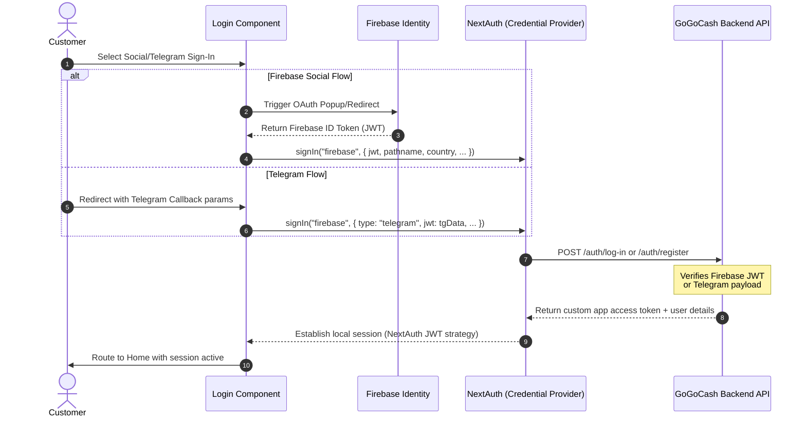
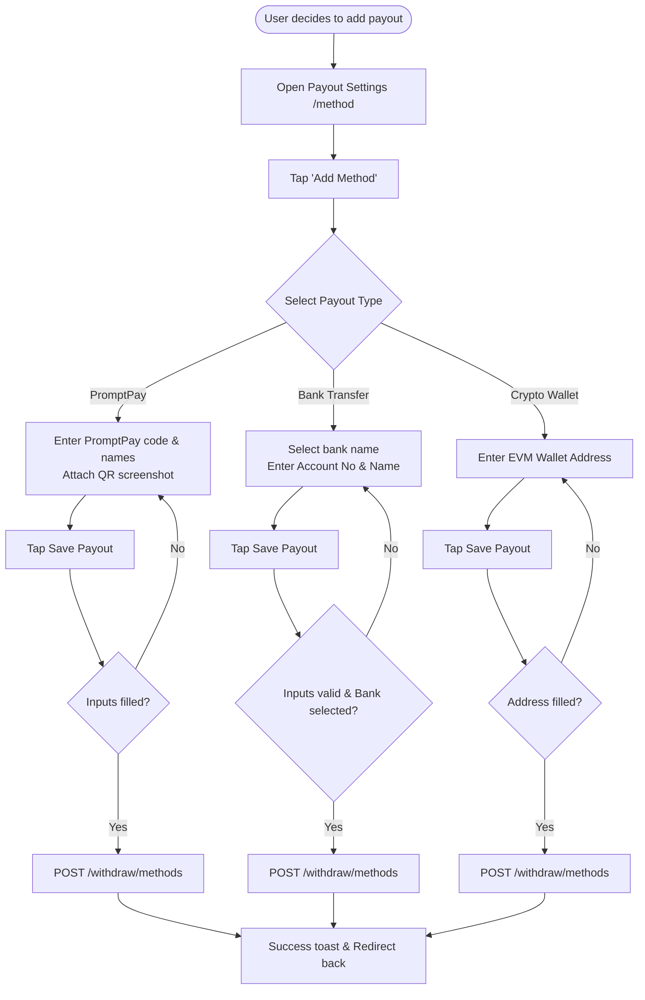
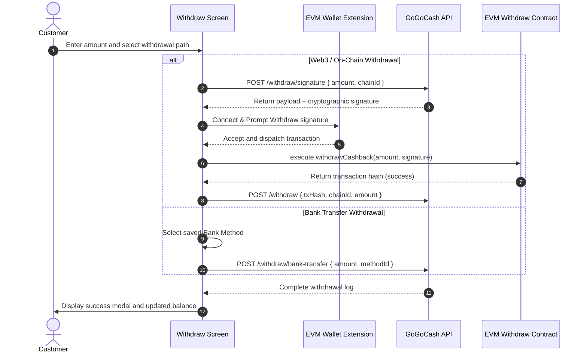

# GoGoCash Customer Journeys spec

This document maps the primary end-to-end customer journeys and visualizes their system interactions using Mermaid sequence diagrams and step descriptions.

---

## 1. Social Login & Session Establishment

This sequence documents how a user authenticates using social entry points (Google/X/Facebook/Telegram) and is matched to an active NextAuth session.

---

## 2. Payout Method Creation & Selection

Users can add PromptPay, Bank Transfer, or Crypto Wallet payout methods to receive their cashback.

---

## 3. Web3 & Bank Cashback Withdrawal

Once the user has available cashback, they can withdraw it either directly via on-chain smart contracts (Web3) or local bank transfer.

---

**Related:** Customer app UI theming — [dark-mode.md](./dark-mode.md).
