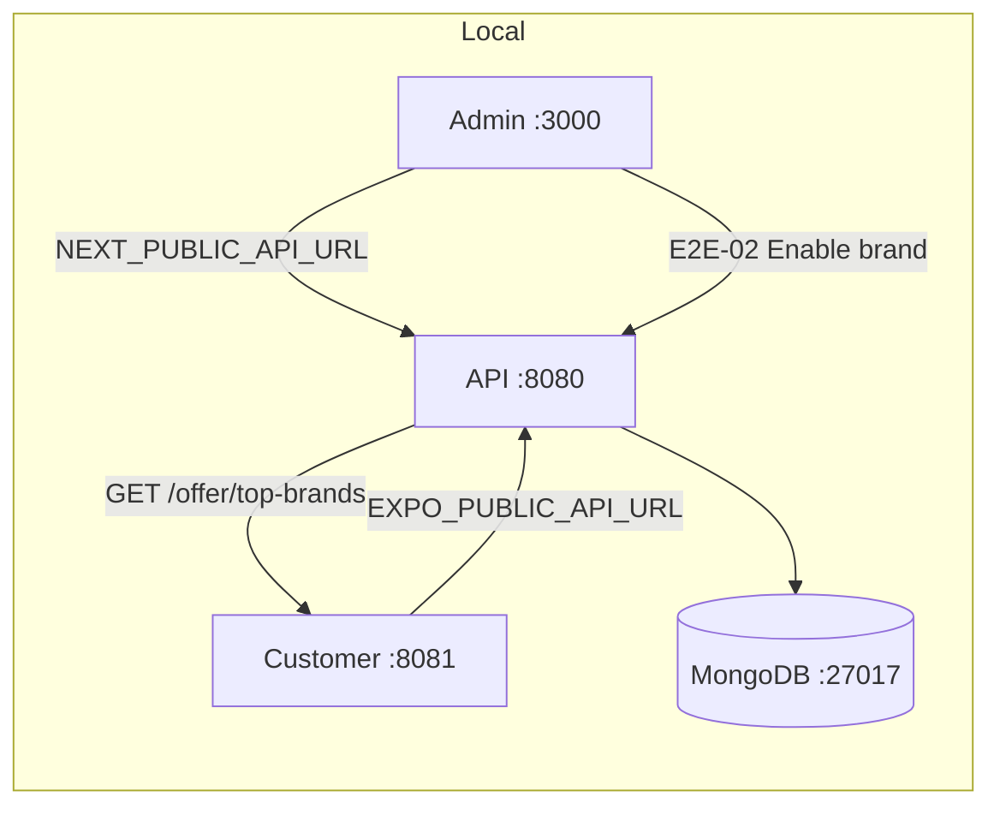

# GoGoCash Local E2E QA Test Plan

Prepared for the Turborepo monorepo: NestJS API (`apps/api`), Next.js admin (`apps/admin`), Expo customer app (`apps/app`).

**Target:** full local stack (API + Admin + Customer app + MongoDB) for cross-system end-to-end validation.

---

## 1. Test environment

### 1.1 Local stack (recommended for true E2E)

| Component | URL / connection | Config file |
|-----------|------------------|-------------|
| MongoDB | `mongodb://localhost:27017/gogocash` | Docker: `gogocash-mongo` |
| API (NestJS) | http://localhost:8080 | `apps/api/.env` |
| Admin (Next.js) | http://localhost:3000 | `apps/admin/.env.local` |
| Customer app (Expo web) | http://localhost:8081 | `apps/app/.env` |

**Required env alignment** (all three apps must share the same API host):

```bash
# apps/admin/.env.local
NEXT_PUBLIC_API_URL=http://localhost:8080
NEXTAUTH_URL=http://localhost:3000
NEXT_PUBLIC_APP_URL=http://localhost:8081

# apps/app/.env
EXPO_PUBLIC_API_URL=http://localhost:8080
EXPO_PUBLIC_ACCOUNT_DATA_SOURCE=backend
EXPO_PUBLIC_FRONTEND_URL=http://localhost:8081
```

### 1.2 Start commands

```bash
docker start gogocash-mongo                    # if stopped
cd apps/api && npm run seed:local-admin        # admin user (idempotent)
cd apps/api && npm run start:dev               # :8080
cd apps/admin && npm run dev                   # :3000
cd apps/app && npx expo start --web --port 8081
```

### 1.3 Health checks (run before any manual QA)

| Check | Command / action | Expected |
|-------|------------------|----------|
| Mongo ping | `mongosh --eval "db.runCommand({ ping: 1 })"` | `{ ok: 1 }` |
| API alive | `curl -s -o /dev/null -w "%{http_code}" http://localhost:8080/` | `200` |
| Public offers | `curl -s http://localhost:8080/offer/top-brands` | JSON (may be `[]` on empty DB) |
| Admin | Open http://localhost:3000/signin | Sign-in page loads |
| Customer | Open http://localhost:8081 | Home loads |
| Swagger | http://localhost:8080/doc_68bf99fed9667685c1637607 | API docs |

### 1.4 Test accounts

| Role | Where | Credentials | Notes |
|------|-------|-------------|-------|
| Super admin | Admin | `admin@gogocash.co` / `1234` | Seeded via `npm run seed:local-admin` |
| Customer (backend) | Customer app | Firebase phone OTP | Needs `EXPO_PUBLIC_FIREBASE_*` + reCAPTCHA + authorized domains |
| Customer (fixtures) | Customer app | Seeded session in Playwright | For UI-only QA without Firebase |

**Important:** When `NEXT_PUBLIC_API_URL` is set, admin authenticates via `POST /admin/login` on the real API (not mock `/api/mock`).

### 1.5 Alternative: hybrid mode (UI local + staging data)

Useful when Mongo is empty or Firebase local setup is incomplete:

- Admin + app: `NEXT_PUBLIC_API_URL` / `EXPO_PUBLIC_API_URL` → `https://api-staging.gogocash.co`
- No local API/Mongo required
- **Not** full local E2E — document which mode was used in test results

---

## 2. Scope & priorities

### P0 — Must pass for local E2E sign-off

Cross-system journeys where admin changes propagate to the customer app via shared Mongo/API.

### P1 — Important product flows

Single-app flows with real API reads/writes.

### P2 — Regression / polish

RBAC, edge cases, dark mode, desktop layout, security boundaries.

### Out of scope (local E2E)

- On-chain withdraw / Web3 / Crossmint / MiniPay SIWE
- Stripe billing (disabled locally: `STRIPE_BILLING_ENABLED=false`)
- Involve Asia live postbacks (need secrets)
- GCS media uploads (need `GOOGLE_APPLICATION_CREDENTIALS`)
- Native Android GoGoSense (device + EAS dev client)
- Production/staging-only Firebase parity

---

## 3. P0 cross-system E2E journeys

### E2E-01: Admin login → Brands list loads (no crash)

| Step | Action | Expected |
|------|--------|----------|
| 1 | Open http://localhost:3000/signin | Sign-in form |
| 2 | Login `admin@gogocash.co` / `1234` | Redirect to dashboard |
| 3 | Sidebar → Brands Management → Brands | `/brands` loads |
| 4 | Open any brand detail / edit form | Form renders; **Partner rates on file** shows min/max (no TypeError) |
| 5 | Check browser console | No uncaught errors |

**Regression note:** Involve-style commission objects `{ Commission: "2.80%" }` must parse correctly (`apps/admin/src/lib/offerDeeplink.ts`).

---

### E2E-02: Brand enable → customer Top Brands

| Step | Action | Expected |
|------|--------|----------|
| 1 | Admin → `/brands` → pick a disabled brand | Status visible |
| 2 | Enable brand + set commission / save | Success toast; API `200` |
| 3 | Admin → `/brands?tab=top-brands` → add brand → **Save top brands** | `PUT /admin/top-brands` succeeds |
| 4 | Customer app http://localhost:8081 → Home | Brand appears in Top Brands (may need refresh) |
| 5 | Verify API | `GET /offer/top-brands` includes enabled brand |

**Fail if:** Admin shows brand but customer home does not (usually mismatched API URLs).

---

### E2E-03: Home banner schedule → customer hero

| Step | Action | Expected |
|------|--------|----------|
| 1 | Admin → Banner → homepage carousel | Banner list |
| 2 | Create/edit banner with **today** as start date | Saved |
| 3 | Customer → Home | Hero banner visible |
| 4 | Set end date to yesterday | Banner disappears after refresh |

**Note:** Date-only fields are treated as local calendar days.

---

### E2E-04: Brand policy/terms → customer shop detail

| Step | Action | Expected |
|------|--------|----------|
| 1 | Admin → Brands → Policy Management tab | Policy editor |
| 2 | Edit terms for a brand → save | Success |
| 3 | Customer → open that shop (`/shop/[id]`) | Terms panel shows updated copy |

---

### E2E-05: Coupon create → customer shop detail

| Step | Action | Expected |
|------|--------|----------|
| 1 | Admin → Coupon → create coupon for a brand | JSON POST to `/offer/update-coupon` |
| 2 | Customer → same shop detail | Coupon chip / deals section reflects coupon |

---

### E2E-06: Admin user list ↔ customer registration (if Firebase configured)

| Step | Action | Expected |
|------|--------|----------|
| 1 | Customer → `/login` → complete phone OTP | Session established |
| 2 | Admin → Users Management → GoGoCash Users | New user appears |
| 3 | Customer → `/profile` | Profile fields load from `GET /user/profile` |

**Blocker without Firebase:** Skip or use fixtures mode for customer UI only.

---

### E2E-07: Withdraw request → admin queue (money path)

| Step | Action | Expected |
|------|--------|----------|
| 1 | Customer with balance → add bank method → request withdraw | `POST /withdraw/bank-transfer` → `pending` |
| 2 | Admin → Withdraw Management | Request visible |
| 3 | Admin → detail → approve/reject | Status updates; balance gate respected |

**Security checks (from `SECURITY_HARDENING.md`):**

- Cannot withdraw more than balance
- Client cannot self-approve via `tx_hash`
- On-chain withdraw lands in `pending` until admin approve

---

## 4. P1 admin-only flows (real API)

| ID | Area | Route | Key validations |
|----|------|-------|-----------------|
| ADM-01 | Dashboard | `/dashboard` | Loads metrics without mock fallback |
| ADM-02 | Create brand | `/brands/create-brand` | Affiliate + app tracking link saved |
| ADM-03 | Commission mgmt | `/brands?tab=commission` | Partner rates parsed; suggested deeplink |
| ADM-04 | Conversion | `/conversion` | List + tabs; date format dd/mm/yyyy |
| ADM-05 | Withdraw detail | `/withdraw/[id]` | Tabs load; real API error messages in toasts |
| ADM-06 | Quest | `/quest` | Create requires **super_admin** (`quest:manage`) |
| ADM-07 | Category | `/category` | CRUD + icon upload (GCS may fail locally — note) |
| ADM-08 | Fee config | `/fee` | Save persists |
| ADM-09 | RBAC viewer | Login `viewer@…` / `1234` | Sidebar hides manage actions; `/403` on forbidden routes |
| ADM-10 | RBAC editor | Login `editor@…` / `1234` | Can edit content; cannot manage admin users |

---

## 5. P1 customer app flows (backend mode)

Reference: `apps/app/docs/pages_details.md`, `apps/app/docs/customer_journeys.md`.

| ID | Journey | Route(s) | API endpoints | Auth |
|----|---------|----------|---------------|------|
| CUS-01 | Home discovery | `/` | `/offer/banner-home`, `/offer/top-brands` | Public |
| CUS-02 | Shop directory | `/shops`, `/shop/[id]` | `/offer`, `/offer/:id` | Public read |
| CUS-03 | Brand directory | `/brand` | Offer directory APIs | Public |
| CUS-04 | Category drill-down | `/category`, `/category/[name]` | Category + store filters | Public |
| CUS-05 | Favorites | `/favorite` | Favorites API | Auth |
| CUS-06 | Wallet | `/wallet` | `/withdraw/check` | Auth |
| CUS-07 | Payout methods | `/method` | `/withdraw/methods` CRUD | Auth |
| CUS-08 | GoGoLink | `/golink` | Link validation (client-side + preview) | Public |
| CUS-09 | Quest | `/quest` | Quest tasks API | Auth |
| CUS-10 | Missing orders | `/missing-orders` | Submit claim API | Auth |
| CUS-11 | Referral | `/referral` | `/point/referral-list` | Auth |
| CUS-12 | Profile / settings | `/profile`, `/language` | Profile + appearance | Auth |
| CUS-13 | Auth guard | Protected routes while logged out | Redirect to `/login` | — |

**Excluded in backend mode:** Connect Wallet, Crypto payout tab, on-chain withdraw.

---

## 6. P2 non-functional & regression

| ID | Area | How to test | Pass criteria |
|----|------|-------------|---------------|
| NF-01 | API URL consistency | Compare env in admin + app | Same host |
| NF-02 | Console cleanliness | Expo web on `/`, `/shops`, `/profile` | No RN Web deprecation errors |
| NF-03 | Dark mode | Account Settings → Dark → P0 routes | No light-gray leaks |
| NF-04 | Desktop home (≥1024px) | Home at 1624×900 | 2-row brand rails; footer scrolls with content |
| NF-05 | Thai locale | Switch language where supported | No overlap/clipping |
| NF-06 | 401 handling | Expire/delete session → hit wallet | Redirect/login; no stale data |
| NF-07 | Admin error surfacing | Trigger validation error on save | Toast shows API message (not generic "Save failed") |
| NF-08 | Commission object parsing | Open brand with Involve commissions | Min/max % displays; no TypeError |

---

## 7. Automation mapping

Run these **before** manual E2E to catch regressions early.

### 7.1 API integration (Mongo required)

```bash
cd apps/api
MONGO_URI=mongodb://localhost:27017/gogocash npm run test:e2e
```

Covers boot smoke + withdraw balance integration against real Mongo.

### 7.2 Admin unit tests

```bash
cd apps/admin && npm run test
# Includes offerDeeplink commission parsing (E2E-01 regression)
```

### 7.3 Customer app gates

```bash
npm --prefix apps/app run typecheck
npm --prefix apps/app run test
npm --prefix apps/app run test:render
```

Covers route contracts, user-flow parity, API integration scope.

### 7.4 Customer Playwright (fixtures session — UI smoke)

With Expo already running on :8081:

```bash
MOBILE_PLAYWRIGHT_NO_SERVER=1 npx --prefix apps/app playwright test
```

Or let Playwright start the server:

```bash
npx --prefix apps/app playwright test
```

**Covers:** P0 route content, desktop shell, GoGoLink, referral copy/share, category search/sort, legal links, no placeholder copy.

**Does not cover:** Admin ↔ API ↔ customer propagation (manual E2E-02–05).

### 7.5 Suggested automation gaps (future)

| Gap | Priority | Suggestion |
|-----|----------|------------|
| Admin login + brand save | P0 | Playwright for admin against local API |
| Admin change → customer assertion | P0 | Shared test brand ID + API poll |
| Firebase OTP login | P0 | Test phone + Firebase emulator |
| Withdraw approve flow | P0 | API seed user with balance + admin Playwright |

---

## 8. Test execution checklist

### Pre-flight (5 min)

- [ ] Mongo running (`gogocash-mongo`)
- [ ] All three services up (8080, 3000, 8081)
- [ ] Env files aligned to `http://localhost:8080`
- [ ] `npm run seed:local-admin` run
- [ ] Automation suite green (§7)

### Manual E2E session (≈2–3 hrs)

- [ ] E2E-01 through E2E-07 (skip blocked items, note why)
- [ ] Spot-check 3–5 ADM-* flows
- [ ] Spot-check 3–5 CUS-* flows (fixtures or Firebase)
- [ ] NF-01, NF-02, NF-08

### Sign-off criteria

| Tier | Criteria |
|------|----------|
| **Pass** | All P0 E2E journeys pass; no P0/P1 bugs open; automation green |
| **Pass with notes** | Firebase/GCS/Involve blocked items documented; P0 cross-system (E2E-01–05) pass |
| **Fail** | Any P0 cross-system journey broken; money path bypasses balance gate; admin crash on real API data |

---

## 9. Bug report template

```
Title: [E2E] <journey-id> <short description>

Environment: local full stack | hybrid staging API
Services: API :8080 | Admin :3000 | App :8081
Data mode: backend | fixtures
Account: admin@gogocash.co | customer (Firebase / fixtures)

Steps:
1.
2.

Expected:
Actual:

API evidence: (Network tab / curl response)
Screenshots:
Severity: P0 | P1 | P2
```

---

## 10. Known blockers & workarounds

| Blocker | Affects | Workaround |
|---------|---------|------------|
| No Firebase config | CUS-06+, E2E-06, E2E-07 | `EXPO_PUBLIC_ACCOUNT_DATA_SOURCE=fixtures` for UI-only |
| Empty Mongo | E2E-02–05 | Seed offers via admin Create brand, or restore partial `mongorestore` |
| GCS credentials missing | Category/banner image upload | Test text-only fields; skip upload |
| Involve secrets empty | Live affiliate sync | Test manually created brands only |
| Playwright uses fixtures session | Automated customer tests | Manual backend-mode pass for E2E-02–05 |

---

## 11. Architecture reference



---

## Related docs

- `apps/app/DESIGN_QA_PLAN.md` — customer UI/design parity QA
- `apps/app/docs/security-pentest-checklist.md` — security audit checklist
- `apps/admin/docs/RBAC.md` — admin role testing
- `SECURITY_HARDENING.md` — money/auth regression expectations
- `apps/app/docs/api-integration.md` — customer backend mode setup
