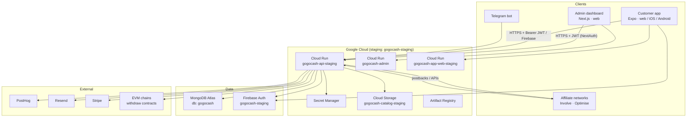
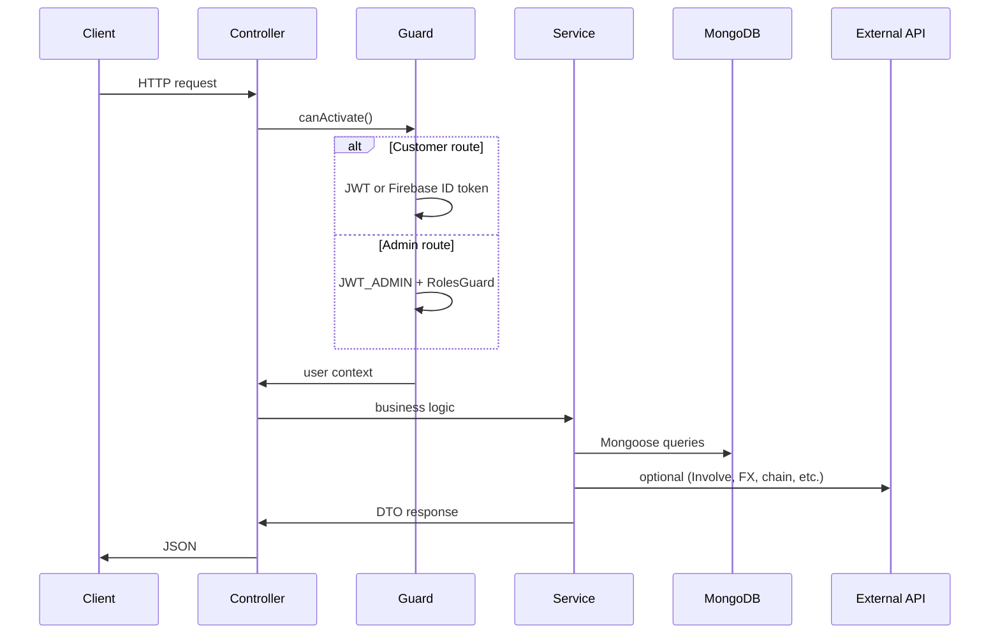
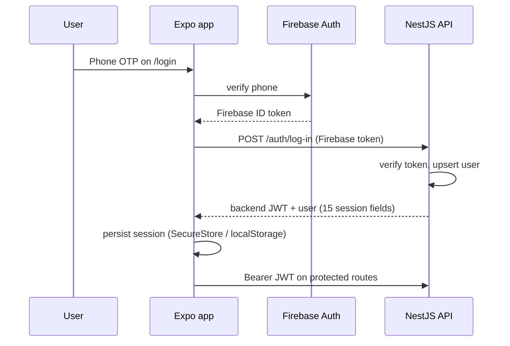
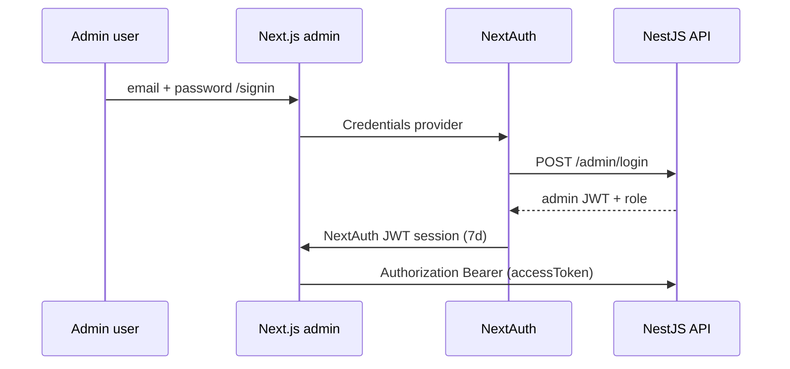

# GoGoCash — Tech Stack & Architecture

> Thailand cashback platform. Turborepo monorepo with three apps sharing one NestJS API and MongoDB.
> **Dependency pins verified against workspace manifests:** 2026-07-14 (`package.json` × 4, lockfile, CI/deploy workflows).

---

## 1. System overview



**Outside this monorepo:** marketing/landing site (`gogocash-landing-page`).

---

## 2. Monorepo layout

```text
gogocash-monorepo/
├── apps/
│   ├── api/          # NestJS backend (contract source of truth)
│   ├── admin/        # Next.js internal dashboard
│   └── app/          # Expo customer app (@gogocash/mobile)
├── packages/         # planned (directory not created yet): contracts, i18n, tsconfig
├── cloudbuild/       # GCP Cloud Build CI/CD
├── docs/             # runbooks, QA plans, this file
├── turbo.json
└── package.json      # npm workspaces + turbo
```

| Concern | Choice |
|---------|--------|
| Workspaces | **npm workspaces** (`apps/*`, `packages/*`) |
| Task runner | **Turborepo ^2.10** — `build`, `lint`, `typecheck`, `test` |
| Node | **≥ 24 (LTS)** |
| Package manager | **npm 10.9.8** |
| Language | **TypeScript 7** (API/app/MCP), **5.9** (admin) |
| Branch policy | **`main`** canonical; staging-first deploys |

---

## 3. Tech stack by app

### 3.1 `apps/api` — Backend

| Layer | Technology |
|-------|------------|
| Framework | **NestJS 11.1.x** on **Express 5.1** |
| Database | **MongoDB** via **Mongoose 9.7.x** / driver **7.5.x** |
| Auth | **JWT** (`JWT_SECRET`, `JWT_ADMIN_SECRET`), **Firebase Admin 14**, Passport |
| Validation | **class-validator 0.15** + global **ValidationPipe** |
| Security headers | **helmet 8** |
| Scheduling | **@nestjs/schedule 6** (cron) + HTTP break-glass **TasksModule** |
| Caching | **cache-manager 7** (in-memory) |
| API docs | **Swagger** at `/doc_68bf99fed9667685c1637607` |
| Testing | **Jest 30**, Supertest 7, real-Mongo integration tests |
| Lint | **Oxlint 1.74** |
| Package manager | **npm** (monorepo root lockfile; build via `npm run build -w gogocash-api`) |
| Container | **node:24-alpine** multi-stage Dockerfile (`apps/api/Dockerfile`) |

**Key integrations:** Involve Asia, Optimise Media, Stripe, Resend, PostHog, GCS, Google Drive (legacy), Telegraf, ethers (on-chain withdraw).

### 3.2 `apps/admin` — Admin dashboard

| Layer | Technology |
|-------|------------|
| Framework | **Next.js 16.2.10** (App Router, Turbopack dev) |
| UI | **React 19.2.7** |
| Styling | **Tailwind CSS 4** + **MUI 9.2** + **Data Grid 9.8** |
| Charts | ApexCharts 5.16, Recharts 3.9, FullCalendar 6.1 |
| Data | **TanStack React Query 5.101**, Axios 1.18 |
| Auth | **NextAuth 4.24** (Credentials → JWT session, 7-day max age) |
| Firebase client | **firebase 12.16** (optional static-hosting builds) |
| Lint | **Oxlint 1.74** |
| Testing | **Vitest 4.1.10**, Testing Library, happy-dom |

**Data modes:** real API when `NEXT_PUBLIC_API_URL` is set; in-memory `/api/mock` otherwise.

**RBAC:** tiered + dynamic roles (`src/lib/rbac`).

### 3.3 `apps/app` — Customer app

| Layer | Technology |
|-------|------------|
| Framework | **Expo SDK 57** (`expo ^57.0.4`) |
| Native | **React Native 0.86.0** |
| Web | **react-native-web 0.21.2** |
| UI | **React 19.2.7** |
| Routing | **expo-router ~57.0.4** |
| Data | TanStack React Query 5.101, custom API client |
| Auth | **Firebase 12.16** phone OTP → `POST /auth/log-in` → API session |
| Storage | expo-secure-store (native), localStorage (web) |
| i18n | react-intl 10 + web ICU catalogs |
| Observability | Sentry RN 7.11 (Expo-compatible), PostHog RN 4.55 |
| Native | **GoGoTrack** detector module (Android, EAS dev client) |
| Testing | Vitest 4.1.10 (logic + render), Playwright (Expo web) |
| Builds | **EAS** (`eas.json`: dev/preview → staging API; production → `disabled` data source) |

**Data modes:** `fixtures` | `backend` | `disabled` via `EXPO_PUBLIC_ACCOUNT_DATA_SOURCE`.

---

## 4. Deployment architecture

### 4.1 Staging (primary environment)

| Service | Host | Region |
|---------|------|--------|
| API | `https://api-staging.gogocash.co` | `asia-southeast1` |
| Admin | `https://admin-staging.gogocash.co` | `asia-southeast1` |
| Customer web | `https://app-staging.gogocash.co` | `asia-southeast1` |

**GCP project:** `gogocash-staging` (729804769570)

Cloud Run services:

- `gogocash-api-staging` — NestJS API, secrets from Secret Manager
- `gogocash-admin` — Next.js standalone
- `gogocash-app-web-staging` — Expo web export

CI/CD:

- **CI:** GitHub Actions `ci.yml` — path-filtered per app (Node 24 LTS, `npm ci` at root)
- **Image build:** `build-staging.yml` on push to `main` (+ manual) — builds `:staging-candidate` images
- **Deploy:** `release-staging.yml` — **manual `workflow_dispatch`** only (pick app + tag → Cloud Run)
- **Alternative:** Cloud Build configs in `cloudbuild/` (see `docs/gcp-cicd.md`)

Per-app deploy workflows (all manual dispatch): `deploy-api-staging.yml`, `deploy-admin-staging.yml`, `deploy-app-web-staging.yml`, `deploy-app-native-eas.yml`.

### 4.2 Local development

| Service | Port | Notes |
|---------|------|-------|
| API | 8080 | `npm run start:dev` in `apps/api` |
| Admin | 3000 | `npm run dev` in `apps/admin` |
| Customer (Expo web) | 8081 | `npx expo start --web --port 8081` |
| MongoDB | 27017 | Docker `gogocash-mongo` or Atlas |

See [`docs/E2E_QA_PLAN.md`](./E2E_QA_PLAN.md) for full local E2E setup.

### 4.3 Secrets & config

Staging API reads from **GCP Secret Manager**, including:

- `gogocash-staging-mongo-uri`
- `gogocash-staging-jwt-secret` / `gogocash-staging-jwt-admin-secret`
- `gogocash-staging-involve-secret`, `gogocash-staging-involve-postback-secret`
- Firebase, PostHog, Telegram, Resend, etc.

Runtime env (non-secret): `GCS_CATALOG_BUCKET=gogocash-catalog-staging`, staging URLs for `WEB_APP_URL`, `API_BASE_URL`, `ADMIN_APP_URL`.

Admin uses `NEXTAUTH_SECRET` + public `NEXT_PUBLIC_API_URL`. Customer uses `EXPO_PUBLIC_*` baked at build time.

---

## 5. Data architecture

### 5.1 Primary store

| Environment | Cluster | Tier | Database name |
|-------------|---------|------|---------------|
| Production | `gogocash` | M10 | `gogocash` |
| Staging | `gogocash-staging` | M0 (512 MB) | `gogocash` |
| Local | Docker / Atlas | — | `gogocash` |

**Single logical database** — all apps read/write the same MongoDB via the API (admin never talks to Mongo directly in production).

### 5.2 Media

- **Primary:** Google Cloud Storage (`gogocash-catalog-staging` / prod bucket)
- **Legacy:** Google Drive file IDs (still render/delete on replace)
- Served via `StoredMediaService` (`apps/api/src/media/`)

### 5.3 Core domain collections (conceptual)

| Domain | Examples | Owner module |
|--------|----------|--------------|
| Users | `users`, MyCashback links | `user/` |
| Admins | `useradmins` | `admin/user-admin/` |
| Offers & brands | `offers`, categories, coupons, banners, top brands | `offer/`, `brand/` |
| Affiliates | deeplinks, conversions | `involve/` |
| Money | withdrawals, methods, conversions, fee rates | `withdraw/` |
| Engagement | points, quests, referrals | `point/` |
| Ops | missing orders, wallet adjustments, search config | `admin/*` |
| GoGoTrack | merchant detection config | `gototrack/` |

---

## 6. API architecture (NestJS monolith)

### 6.1 Module map

```text
apps/api/src/
├── main.ts              # bootstrap, CORS, Swagger, ValidationPipe
├── app.module.ts        # root wiring
├── auth/                # customer + shared guards
├── user/                # profiles, MyCashback
├── offer/               # catalog, favorites, banners, coupons
├── brand/               # brand catalog
├── catalog/             # commerce catalog, carts, Stripe commerce payments
├── involve/             # Involve Asia sync, deeplinks, postbacks
├── withdraw/            # balance, methods, bank/on-chain withdraw, crons
├── point/               # points, quests, referral points
├── admin/               # all admin-facing REST (see below)
├── analytics/           # PostHog
├── media/               # GCS uploads (StoredMediaService)
├── google-drive/        # legacy Drive integration (migration path)
├── email/               # Resend
├── customer-billing/    # Stripe
├── gototrack/           # detection merchants API
├── policy/              # policy terms
├── tasks/               # admin break-glass job triggers
└── telegram-bot/        # optional Telegraf module
```

### 6.2 Request lifecycle



### 6.3 Admin API surface (`admin/`)

Controllers include: dashboard, transactions, wallets, missing orders, referrals, credit scores, membership, subscriptions, discover, search, commission management, plus core admin auth/user CRUD on `AdminController`.

**Also at root level (not under `admin/`):** `catalog/` exposes public catalog/commerce routes and admin catalog/commerce controllers (`CatalogController`, `AdminCatalogController`, `CommerceController`, etc.).

Guards: **AuthAdminGuard** (`jwt-auth-admin.guard.ts`), **RolesGuard**, **RateLimitGuard**. Customer routes use **FirebaseAuthGuard** / **JwtAuthGuard**.

### 6.4 Background jobs

- **In-process cron** via `@nestjs/schedule` in `withdraw/cronjob/` (conversion sync, points, offer updates)
- **HTTP triggers** via `TasksController` for admin break-glass (protected by admin auth)

---

## 7. Authentication architecture

Two separate identity paths converge on the same API.

### 7.1 Customer (Expo app)



**Guard:** `FirebaseAuthGuard` — accepts backend JWT **or** Firebase ID token (auto-refresh path).

**Mobile backend mode excludes:** Crossmint, Web3/ethers, on-chain withdraw, crypto payout tab.

### 7.2 Admin (Next.js)



**Enforcement layers (admin UI):**

1. **UI** — `usePermissions()`, `<Can>`, sidebar filtering
2. **Route proxy** — `src/proxy.ts` → `/403` by built-in role tiers
3. **API** — `RolesGuard` + permission checks on write routes

---

## 8. Customer app architecture

### 8.1 Layering

```text
app/                     # expo-router file routes
src/
├── screens/             # route screen components
├── components/          # shared UI (BrandCard, shells, etc.)
├── account/             # customerAccountResource — fixtures vs backend seam
├── api/                 # client, mappers, DTO types
├── auth/                # session store, guards, Firebase login
├── navigation/          # route catalog, auth requirements
├── design/              # web parity constants
├── theme/               # light/dark tokens
└── gototrack/           # detection UI + hooks
```

### 8.2 Data flow (backend mode)

```text
Screen
  └─ useCustomerAccountResource({ resourceId, fixtureData })
       ├─ fixtures  → synchronous fixtureData
       ├─ disabled  → empty/disabled state
       └─ backend   → React Query → createMobileApiClient(apiUrl)
                            └─ Bearer from session; 401 → clearSession
  └─ mapper transforms API DTO → same view-model as fixtures
```

**Key principle:** screens never branch on raw API shape inline — mappers normalize to fixture-shaped view models.

### 8.3 Routing & auth

- **expo-router** file-based routes under `app/`
- **Stack.Protected** in `app/_layout.tsx` for auth-gated routes
- Public: home, shops, brand, login; protected: wallet, profile, withdraw, favorites, etc.

---

## 9. Admin frontend architecture

```text
src/
├── app/
│   ├── (admin)/         # authenticated shell + sidebar
│   ├── (full-width-pages)/  # signin, errors
│   └── api/
│       ├── auth/[...nextauth]/
│       └── mock/[...path]/  # in-memory mock API (no NEXT_PUBLIC_API_URL)
├── components/<feature>/    # OffersTable, FormOffer, WithdrawDetail, …
├── layout/                  # AppSidebar, AppHeader
├── lib/
│   ├── api.ts               # ApiClient singleton
│   ├── axios/               # interceptors
│   ├── rbac/                # permissions matrix
│   └── mockApiCore.ts       # mock routing + RBAC on writes
├── proxy.ts                 # Next.js 16 edge route guard
└── types/                   # API DTO types (keep in sync with api/)
```

---

## 10. Cross-app integration (E2E contract)

For admin changes to appear in the customer app:

| Requirement | Admin | Customer |
|-------------|-------|----------|
| Same API host | `NEXT_PUBLIC_API_URL` | `EXPO_PUBLIC_API_URL` |
| Real data | not mock mode | `EXPO_PUBLIC_ACCOUNT_DATA_SOURCE=backend` |
| Shared DB | — | via API only |

Example propagation: **Admin enables brand + saves top brands** → `PUT /admin/top-brands` → `GET /offer/top-brands` → customer home Top Brands rail.

---

## 11. External systems

| System | Role |
|--------|------|
| **Involve Asia / Optimise** | Offer ingestion, commissions, postbacks, deeplinks |
| **Firebase** | Customer phone auth (staging: `gogocash-staging`) |
| **Stripe** | Customer subscription billing (server-side) |
| **Resend** | Admin invite, password reset, transactional email |
| **PostHog** | Product analytics (API truth events + customer app) |
| **Telegram** | Bot login + ops alert groups |
| **EVM RPC + contracts** | On-chain withdraw (admin approve flow) |
| **ExchangeRate API** | FX for withdraw balance (cached, fail-closed) |

---

## 12. CI / quality gates

| App | Required gates |
|-----|----------------|
| API | **lint** · **unit tests** · **build + boot smoke + Mongo integration** (`withdraw-balance.e2e-spec.ts`) |
| Admin | **vitest** · **`next build`** — lint runs but is **informational** (~54 react-hooks warnings, #45) |
| App | **typecheck** · **vitest unit** · **vitest render** · **web export** (no `lint` script) |

Path-filtered in `.github/workflows/ci.yml`. Deploys are **not** in CI — see §4.1 CI/CD pipeline.

---

## 13. Security architecture (summary)

See [`SECURITY_HARDENING.md`](../SECURITY_HARDENING.md) for full register.

| Area | Control |
|------|---------|
| Input | Global ValidationPipe on API |
| Withdraw | Balance gate, pending + admin approve, serialized bank-transfer txn |
| IDOR | Withdraw methods scoped to `{ _id, user_id }` |
| Involve AI route | Fail-closed API key (`INVOLVE_AI_API_KEY`) |
| Admin session | 7-day NextAuth max age |
| FX | Cached + timeout + fail-closed (no silent zero balance) |

---

## 14. Planned evolution

| Item | Status |
|------|--------|
| `packages/contracts` — shared API types | Planned (#19) |
| `packages/i18n` — shared ICU catalogs | Planned |
| `packages/tsconfig` — shared TS bases | Planned |
| BFF for admin token relay + revocation | Open (#43) |
| Production cutover | Gated — explicit human approval |

---

## 15. Key version pins (from `package.json`, 2026-07-14)

| Package | Version |
|---------|---------|
| Node | ≥ 24 (LTS) |
| npm | 10.9.8 |
| TypeScript | ^7.0.2 / ~5.9.3 |
| React / React DOM | 19.2.7 |
| NestJS (`@nestjs/common` etc.) | ^11.1.28 |
| Mongoose | ^9.7.4 |
| mongodb driver | ^7.4.0 (7.5 resolved) |
| Express | ^5.1.0 |
| firebase-admin (api) | ^14.1.0 |
| Next.js (admin) | 16.2.10 (pinned) |
| next-auth | ^4.24.13 |
| firebase (admin / app) | ^12.16.0 / ^12.16.0 |
| @mui/material | ^9.2.0 |
| @mui/x-data-grid | ^9.8.0 |
| Tailwind CSS (admin) | ^4.0.0 |
| Expo (app) | ^57.0.4 |
| expo-router | ~57.0.4 |
| React Native | 0.86.0 |
| react-native-web | ^0.21.2 |
| Jest (api) | ^30.0.0 |
| Vitest (admin / app) | ^4.1.10 / ^4.1.9 |
| Turbo (root) | ^2.10.5 |
| Lint (API / admin) | Oxlint ^1.74.0 |

Full upgrade history and staged rollout gates: [`UPGRADE_PLAN.md`](../UPGRADE_PLAN.md).

---

## Related docs

- [`README.md`](../README.md) — monorepo overview
- [`docs/E2E_QA_PLAN.md`](./E2E_QA_PLAN.md) — local end-to-end QA
- [`apps/api/README.md`](../apps/api/README.md) — API module deep dive
- [`apps/app/docs/api-integration.md`](../apps/app/docs/api-integration.md) — customer backend wiring
- [`apps/admin/docs/RBAC.md`](../apps/admin/docs/RBAC.md) — admin permissions
- [`docs/gcp-cicd.md`](./gcp-cicd.md) — Cloud Build runbook
- [`SECURITY_HARDENING.md`](../SECURITY_HARDENING.md) — auth/money hardening
