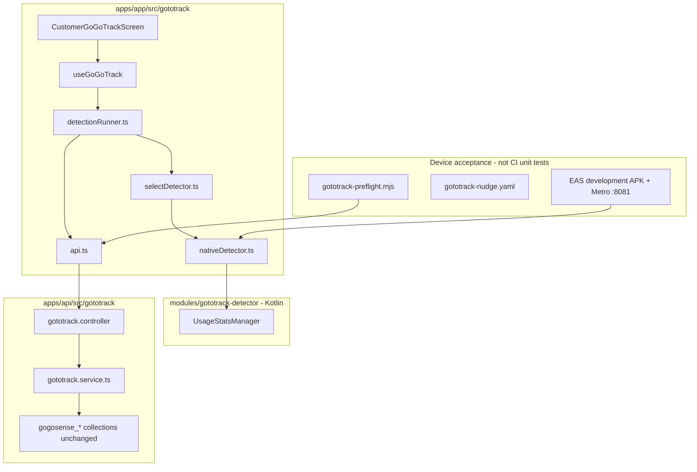

# GoGoTrack Android — Unit Test & Device Acceptance Plan

**Target branch:** [`dev`](https://github.com/mygogocash/gogocash-monorepo/tree/dev) (GoGoTrack rename; `main` still uses GoGoSense naming).

**Primary environment:** Railway **dev** — not staging.

| Surface | URL / service |
| --- | --- |
| API | `https://api.dev.gogocash.co` (`gogocash-api`) |
| Admin | `https://admin.dev.gogocash.co` (`gogocash-admin`) |
| Mongo | `mongo-staging` (Railway dev) — `mongo:8.0.4` + start command `GLIBC_TUNABLES=glibc.pthread.rseq=1` |
| Customer native | EAS **`development`** profile → `EXPO_PUBLIC_API_URL=https://api.dev.gogocash.co` |
| Customer Expo web on Railway | `@gogocash/mobile` at **0 replicas** (use local Metro + dev-client for Android QA) |

**Out of scope:** iOS DeviceActivity in-merchant detection (entitlement pending), deferred MVP (NotificationListener, screenshots), production Play Store submission.

---

## Phase 7 — Background system prompts (Android notification path)

**Status:** implemented on `dev` (2026-06-30); **device QA blocked** until a new EAS `development` dev-client build ships native monitor service + notification actions. Agent cannot pass Phase 7 on an older APK without `GototrackMonitorService`.

| Step | Action | Pass criteria |
| --- | --- | --- |
| 7.1 | Enable **Show cashback prompt while shopping** in GoGoTrack Settings + Usage Access granted | `GototrackMonitorService` foreground notification visible (“GoGoTrack is watching for cashback”) |
| 7.2 | Open seeded merchant (e.g. Shopee) while GoGoCash is backgrounded | Actionable notification: **Cashback available** with Accept / Dismiss |
| 7.3 | Tap **Accept** | App opens `gogocash://gototrack/activate?…` → **POST `/gototrack/activate`** (`source: gototrack_background_prompt`) → affiliate deeplink |
| 7.4 | Tap **Dismiss** | Prompt notification clears; no activation |
| 7.5 | Toggle background prompts off | Monitor service stops; ongoing notification disappears |

**Preflight flags (optional):**

```bash
npm run gototrack:preflight -- \
  --require-background-prompt \
  --evidence-dir /tmp/gototrack-acceptance-evidence/
```

Looks for monitor/prompt copy: `GoGoTrack is watching for cashback`, `Cashback available`, `Accept`.

**Play Console:** declare **special-use** foreground service subtype for merchant cashback detection; keep user opt-in disclosure in onboarding/settings.

---

## Status snapshot (2026-06-30)

| Phase | Status |
| --- | --- |
| 0 — Branch alignment | **Done** |
| 1 — `test:gototrack` CI gates | **Done** |
| 2 — Preflight exit codes | **Done** (`preflightExitCode`, fail scenarios) |
| 3 — Regression audit (27 vitest + API specs) | **Done** |
| 4 — `GOGOTRACK_*` env rename | **Done** (`GOGOTRACK_AUTH_TOKEN` primary; `GOTOTRACK_AUTH_TOKEN` / `GOGOSENSE_AUTH_TOKEN` fallback) |
| 5 — Device acceptance | **Done** — Seeker `SM02G4061912033` vs `api.dev.gogocash.co`; full preflight **22/22 pass** with `--require-nudge --tap-nudge --open-deeplink` (evidence: `/tmp/gototrack-acceptance-evidence/`, 2026-06-30) |
| 5D — Maestro nudge | **Optional / pending** |
| 7 — Background system prompts | **Code done** — Phase 7 device checklist + `--require-background-prompt` preflight; **device pass pending EAS rebuild** (owner) |
| 6 — Merge gates (`test:gototrack` + API + `typecheck`) | **Green** (2026-06-30) |

---

## Architecture (what we are testing)



**Principle:** test **behavior at seams**. CLI scripts export testable helpers (`runPreflight`, `preflightExitCode`, `deviceConnectionDetail`, etc.).

---

## Test pyramid

| Layer | Runner | Location | CI? |
| --- | --- | --- | --- |
| **Unit (node)** | `vitest.config.ts` | `apps/app/src/__tests__/gototrack-*.test.ts` | Yes |
| **Render (happy-dom)** | `vitest.render.config.ts` | `*gototrack*.render.test.tsx` | Yes |
| **API unit** | Jest | `apps/api/src/gototrack/*.spec.ts` | Yes |
| **Static contracts** | Vitest | route / native-source / store-privacy / launch contracts | Yes |
| **Native Kotlin** | EAS dev-client + device | `modules/gototrack-detector/` | No |
| **Device acceptance** | `gototrack:preflight` + optional Maestro | `scripts/` + `.maestro/flows/` | Manual |

**Naming:** `subject > given/when > then` (see existing suites).

**Single gate:**

```bash
npm run test:gototrack -w @gogocash/mobile
npm run test:gototrack:api
npm run typecheck -w @gogocash/mobile
```

---

## Phase 0 — Branch alignment ✅

- [x] `apps/app/src/gototrack/` (not `gogosense/`)
- [x] API routes `/gototrack/*`
- [x] Mongo collections remain `gogosense_*`
- [x] `typecheck` + API gototrack specs green on `dev`

---

## Phase 1 — Consolidated CI gate ✅

Scripts in `apps/app/package.json`:

- `test:gototrack` — all GoGoTrack vitest (node + render)
- `test:gototrack:api` — Jest `--testPathPatterns=gototrack`
- `gototrack:preflight`, `gototrack:artifact`, `gototrack:dev-client`

Test matrix documented in [`apps/app/modules/gototrack-detector/README.md`](../apps/app/modules/gototrack-detector/README.md).

---

## Phase 2 — Preflight exit codes ✅

- [x] `preflightExitCode()` in `gototrack-preflight.mjs`
- [x] `runPreflight` fail scenarios: no device, Usage Access denied, wrong foreground
- [x] `npm run test:gototrack` green

---

## Phase 3 — Coverage map ✅

See module README and existing `gototrack-*.test.ts` / `*.render.test.tsx` / `gototrack.service.spec.ts`. No `.skip` / `.only` in gototrack tests.

---

## Phase 4 — Env cleanup ✅

- [x] `GOGOTRACK_AUTH_TOKEN` primary; `GOTOTRACK_AUTH_TOKEN` / `GOGOSENSE_AUTH_TOKEN` fallback (preflight `resolveAuthToken`)
- [x] Preflight `--require-auth` fails without token
- [x] Default API URL: `https://api.dev.gogocash.co` (`eas.json` **development**, `.env.example`, preflight, artifact helper)

---

## Phase 5 — Device acceptance ✅

**Verified 2026-06-30** on Seeker `SM02G4061912033` against `https://api.dev.gogocash.co`.

**Full preflight (exit 0, 22/22 pass):** `--require-auth --require-nudge --tap-nudge --open-deeplink --capture-device-evidence` with customer JWT from `/tmp/gototrack-auth.env` (`GOGOTRACK_AUTH_TOKEN`), merchants seeded (`gogosense_merchants`, Shopee enabled), EAS dev APK SHA-256 `fc92704d645441aa36de6862842a46c17fb2942296cd2fef931f88255fbe3912`, evidence at `/tmp/gototrack-acceptance-evidence/` (`preflight-report.json`, `acceptance-checklist.md`, activation nudge + deeplink captures).

**Key results:** activation nudge visible/tapped, `POST /gototrack/activate` returned `https://invl.me/clnlbvp`, deeplink opened with `com.shopee.th` foreground, Usage Access granted, Metro `adb reverse` on `:8081`.

**Re-run prerequisites:** Metro on `:8081` (`npm run gototrack:dev-client`), device unlocked, and longer waits (`--checkpoint-delay-ms 15000 --dev-client-load-wait-ms 25000`) if the hub lands on home instead of GoGoTrack.

**Depends on:** owner `GOGOTRACK_AUTH_TOKEN`, Railway dev Mongo up, seeded merchants, physical Android with Usage Access.

### 5A — Ops prerequisites (Railway dev)

| Item | How to verify |
| --- | --- |
| **`mongo-staging` Online** | Railway dev → green; logs show `mongod startup complete`. Image **`mongo:8.0.4`**. Start command must export **`GLIBC_TUNABLES=glibc.pthread.rseq=1`** (not `rseq=0` — that overrides the service variable and triggers SERVER-121912 on kernel 6.19+). |
| **API `/gototrack/*` live** | `curl -sS https://api.dev.gogocash.co/gototrack/merchants` → 200 JSON array (may be `[]` before seed) |
| **Admin (optional brand CRUD)** | `https://admin.dev.gogocash.co` — needs `NEXTAUTH_SECRET` + `NEXTAUTH_URL=https://admin.dev.gogocash.co` on `gogocash-admin`. Seed admin in **Railway → `gogocash-api` → dev → Shell**: `npm run seed:local-admin -w gogocash-api -- --force --email admin@gogocash.co --password 1234 --username admin` |
| **≥1 enabled GoGoTrack merchant** | Seed into **`gogosense_merchants`** (not `gototrack_merchants`): TCP proxy or Railway Shell — `npm run gototrack:seed-merchants -w gogocash-api -- --enable-first`. Verify: `curl -sS https://api.dev.gogocash.co/gototrack/merchants` → ≥1 row. |
| **`INVOLVE_SECRET`** | Required for `POST /gototrack/activate` / affiliate deeplinks on dev. **Set** on Railway dev as of 2026-06-30 (activation probe passes in preflight). |
| **`EXPO_TOKEN`** | GitHub secret for `deploy-app-native-eas.yml` |
| **`GOGOTRACK_AUTH_TOKEN`** | Customer JWT for preflight `--require-auth` API probes (primary env var). Fallback: `GOTOTRACK_AUTH_TOKEN`, `GOGOSENSE_AUTH_TOKEN`. Obtain from dev API after seeding a customer, or export from E2E seed flow. **Not** the admin token. |
| **Firebase `EXPO_PUBLIC_FIREBASE_*`** | From GitHub **`staging`** environment secrets (no separate `dev` GH env). Inlined at EAS build; Metro `.env` overrides at dev-client runtime. |

### 5B — Mobile `.env` (Metro / USB dev-client)

```bash
# apps/app/.env
EXPO_PUBLIC_API_URL=https://api.dev.gogocash.co
EXPO_PUBLIC_APP_ENV=dev
EXPO_PUBLIC_ACCOUNT_DATA_SOURCE=backend   # or fixtures + OTP 123456 for UI-only (no live API user)
EXPO_PUBLIC_FRONTEND_URL=http://localhost:8081
```

Restart Metro after edits. **`localhost:8080` on a physical phone points at the phone** — always use `api.dev.gogocash.co` for device QA.

**Sign-in on native Android:** works since APK 40 (app 0.2.0) via `@react-native-firebase/auth` — Play Integrity app verification, test number `+66 999999999` / `654321` needs no SMS (device-verified 2026-07-10; see `docs/firebase-native-eas.md`). For device QA:

- **Preflight / API paths:** `GOGOTRACK_AUTH_TOKEN` (customer JWT) still works — no UI sign-in required.
- **Manual UI sign-in:** phone OTP directly on the device (backend mode), or `EXPO_PUBLIC_ACCOUNT_DATA_SOURCE=fixtures` + OTP `123456` for UI-only runs.
- APK ≤ 39 (runtime 0.1.0) predates the native Firebase module — on those binaries phone OTP remains web-only.

### 5C — Dev-client build + install

```bash
# CI
gh workflow run deploy-app-native-eas.yml -f action=build -f platform=android -f profile=development

# Resolve APK + print preflight command
npm run gototrack:artifact -w @gogocash/mobile -- --run-id <actions-run-id>
```

**Physical device loop:**

```bash
npm run gototrack:dev-client -w @gogocash/mobile   # Metro + adb reverse :8081
adb install -r /path/to/gogocash-development-android.apk
# Open dev-client deep link to http://127.0.0.1:8081
```

**Acceptance criteria:**

- [x] APK installs; dev-client loads Metro bundle (verified on Seeker device)
- [x] SHA-256 verified via `gototrack:artifact` / `--install-apk-sha256` (`fc92704d645441aa36de6862842a46c17fb2942296cd2fef931f88255fbe3912`)
- [x] `adb reverse tcp:8081 tcp:8081` before opening app (`gototrack:dev-client`)

### 5D — Full preflight acceptance run

```bash
export GOGOTRACK_AUTH_TOKEN='<customer-jwt>'
npm run gototrack:preflight -w @gogocash/mobile -- \
  --install-apk /path/to/gogocash-development-android.apk \
  --install-apk-sha256 <sha256> \
  --configure-metro-reverse \
  --merchant-apks /path/to/com.shopee.th.apk,... \
  --merchant-packages com.shopee.th \
  --grant-usage-access \
  --open-merchant \
  --evidence-dir /tmp/gototrack-acceptance-evidence \
  --capture-device-evidence \
  --require-foreground \
  --return-to-gototrack \
  --require-nudge \
  --tap-nudge \
  --activate \
  --open-deeplink \
  --require-auth
```

**Pass checklist (core — done):**

- [x] `preflight-report.json` — no `status: "fail"` (22/22 pass, 2026-06-30)
- [x] Usage Access granted for GoGoCash package
- [x] `merchant-foreground-*` checkpoints
- [x] `device-evidence.txt` + screenshot/window/logcat bundle

**Pass checklist (full activation — done 2026-06-30):**

- [x] `acceptance-checklist.md` — activation nudge + deeplink steps `pass`
- [x] `gototrack-hub-ui.xml` contains activation nudge
- [x] `--tap-nudge` → activate → `activation-deeplink-*` evidence

### 5E — Maestro (optional)

[`apps/app/.maestro/flows/gototrack-nudge.yaml`](../apps/app/.maestro/flows/gototrack-nudge.yaml) — device-only; `workflow_dispatch` if wired in CI.

---

## Phase 6 — Definition of done

**Merge gates on `dev` (green 2026-06-30):**

```bash
npm run test:gototrack -w @gogocash/mobile   # 18 node + 9 render files, 134 tests
npm run test:gototrack:api                  # 27 API tests (from apps/app or -w @gogocash/mobile)
npm run typecheck -w @gogocash/mobile
```

| Gate | Result (2026-06-30) |
| --- | --- |
| `test:gototrack` | **Pass** — 99 node + 35 render tests |
| `test:gototrack:api` | **Pass** — 27 Jest tests |
| `typecheck` | **Pass** |

**Before `dev` → `staging` promotion:**

- [x] Device acceptance evidence captured (`/tmp/gototrack-acceptance-evidence/`, attach to PR)
- [x] Dev merchants seeded and at least one enabled (Shopee)
- [ ] EAS **development** APK rebuilt after any `EXPO_PUBLIC_*` change (rebuild if env changes post-acceptance)
- [ ] Railway `gogocash-api` + `gogocash-admin` use matching public API URL for target env

---

## Long-term maintenance

1. One feature → one test file in the matching layer.
2. Export pure functions from CLI scripts; prefer `runPreflight` with injected adb over subprocess tests.
3. Native Kotlin changes → update `gototrack-native-source-contract.test.ts` + device note in PR.
4. Deferred features: add tests only when implementing.
5. API contract changes → update mobile `gototrack-api.test.ts` and `gototrack.service.spec.ts` together.

---

## Risk notes

- **Native Kotlin not in CI** — intentional; device preflight is the proof.
- **Mongo `gogosense_*` collection names** — do not rename without migration.
- **Railway dev mongo** — if `mongo-staging` crashes with SERVER-121912, confirm image `mongo:8.0.4` and start command uses **`rseq=1`**, not `rseq=0`.
- **Seeding** — use Railway **Shell** on `gogocash-api` (internal `MONGO_URI`); local `railway run` from a laptop fails DNS to `mongo-staging.railway.internal`.

---

## Related docs

- [`apps/app/modules/gototrack-detector/README.md`](../apps/app/modules/gototrack-detector/README.md) — module runbook + preflight flags
- [`docs/mobile-expo-delegation-plan.md`](mobile-expo-delegation-plan.md) — Phase 5 delegation tasks
- [`docs/railway-mongo-replica-set.md`](railway-mongo-replica-set.md) — replica set / kernel notes
- [`AGENTS.md`](../AGENTS.md) — learned dev/Railway/mobile facts
