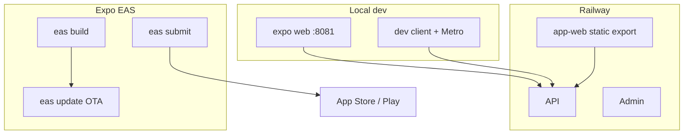
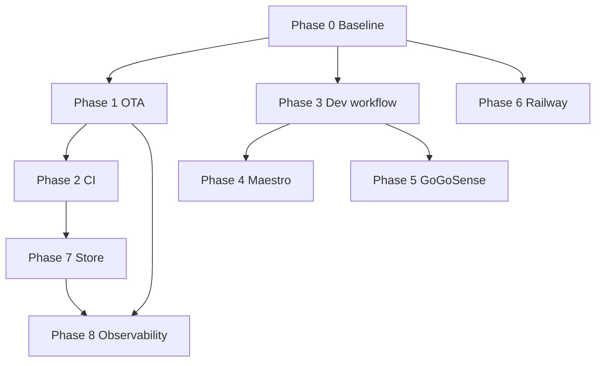

# Mobile / Expo Development — Delegation Plan

Phased breakdown for subagent execution. Each task has a stable **ID**, **scope**, **files**, and **acceptance criteria (AC)**.

**Repo:** `gogocash-monorepo` · **App:** `apps/app` (`@gogocash/mobile`) · **Base branch:** `dev`

**Related docs:** [E2E_QA_PLAN.md](./E2E_QA_PLAN.md), [railway-execution-runbook.md](./railway-execution-runbook.md), [apps/app/MIGRATION_PLAN.md](../apps/app/MIGRATION_PLAN.md), [apps/app/AGENTS.md](../apps/app/AGENTS.md)

---

## Already shipped (do not re-implement)

| Area | Evidence | AC met |
|------|----------|--------|
| Local full-stack E2E | `npm run e2e`, `docker-compose.e2e.yml`, `e2e/cross-system/*` | API 17+ integration, cross-system 7/7, admin/customer Playwright backend suites green |
| Railway **web** deploy | `apps/app/Dockerfile.web.railway`, `apps/app/railway.json` | `expo export --platform web` on Railway `app-web` |
| EAS profiles scaffold | `apps/app/eas.json` | `development`, `preview`, `production` profiles exist |
| Dev client + GoGoSense | `gogosense:dev-client`, `modules/gogosense-detector/` | Dev APK + ADB preflight scripts |
| Vitest gates | `test`, `test:render`, `typecheck` in CI | `ci.yml` app job green |

---

## Architecture reference



| Surface | Build | Host |
|---------|-------|------|
| Web customer | `expo export --platform web` | Railway `app-web` |
| Native iOS/Android | `eas build` | EAS → stores / internal |
| JS-only hotfix (target) | `eas update` | Expo channels → installed apps |

---

## Phase 0 — Baseline & docs (prerequisite)

**Goal:** Every subagent can run gates and knows env contracts.

**Depends on:** nothing

### P0-T01 · E2E harness smoke on clean machine

| Field | Value |
|-------|-------|
| **Subagent** | `shell` or `e2e-runner` |
| **Scope** | Verify `npm run e2e` from README-style clean steps |
| **Files** | `package.json`, `scripts/e2e-*`, `docs/E2E_QA_PLAN.md` |

**AC:**
- [ ] `npm install` at repo root succeeds
- [ ] `npm run e2e:up` → Mongo RS PRIMARY within 60s
- [ ] `npm run e2e:seed` → `.e2e/seed.json` contains `customerToken`, `adminToken`, `brandId`
- [ ] `bash scripts/e2e-run-tests.sh` → API e2e + cross-system + admin + customer backend Playwright all pass
- [ ] Document any port-27017 conflict resolution in E2E_QA_PLAN §1 if missing

### P0-T02 · Expo local dev quickstart in app README

| Field | Value |
|-------|-------|
| **Subagent** | `doc-updater` or `generalPurpose` |
| **Scope** | Single “Mobile dev” section in `apps/app/README.md` |
| **Files** | `apps/app/README.md` |

**AC:**
- [ ] Documents: `web` (default), `gogosense:dev-client`, three vitest gates, staging-only API URL pattern
- [ ] Table: Railway web vs EAS native (2 rows, links to this plan)
- [ ] No duplicate of full E2E runbook (link to `docs/E2E_QA_PLAN.md`)

### P0-T03 · Env matrix cross-check

| Field | Value |
|-------|-------|
| **Subagent** | `generalPurpose` |
| **Scope** | Align `.env.example`, `.env.e2e.example`, `eas.json`, `railway-env-matrix.md` |
| **Files** | `apps/app/.env.example`, `.env.e2e.example`, `docs/railway-env-matrix.md`, `apps/app/eas.json` |

**AC:**
- [ ] Every `EXPO_PUBLIC_*` in `.env.example` appears in `eas.json` profiles OR documented as “local-only”
- [ ] Railway `app-web` vars in `railway-env-matrix.md` match `scripts/railway-apply-secrets.sh`
- [ ] Staging API URL consistent: `https://api-staging.gogocash.co` across eas + railway docs

---

## Phase 1 — EAS Update (OTA) end-to-end

**Goal:** `eas update` applies JS bundles to installed dev/preview builds.

**Depends on:** Phase 0

**Maps to:** `MONOREPO_EXECUTION_PLAN` P3-APPNATIVE-1 (OTA half), `MIGRATION_PLAN` release track

### P1-T01 · Add `expo-updates` dependency

| Field | Value |
|-------|-------|
| **Subagent** | `generalPurpose` |
| **Files** | `apps/app/package.json`, root `package-lock.json` |

**AC:**
- [ ] `expo-updates` SDK 56-compatible version in `dependencies`
- [ ] `npm ci` at root succeeds
- [ ] Remove `expo-updates` from `knip.json` `ignoreUnresolved` if resolved

### P1-T02 · Configure `runtimeVersion` + updates in app config

| Field | Value |
|-------|-------|
| **Subagent** | `generalPurpose` — read `.agents/skills/expo-deployment/` |
| **Files** | `apps/app/app.config.ts` |

**AC:**
- [ ] `runtimeVersion` policy defined (`appVersion` or `fingerprint` — document choice in comment)
- [ ] `updates.url` points to EAS project (`extra.eas.projectId` already set)
- [ ] `expo export --platform web` still succeeds (web unaffected)
- [ ] `npm --prefix apps/app run typecheck` passes

### P1-T03 · Channel mapping in `eas.json`

| Field | Value |
|-------|-------|
| **Subagent** | `generalPurpose` |
| **Files** | `apps/app/eas.json` |

**AC:**
- [ ] `development` build → channel `development`
- [ ] `preview` build → channel `staging`
- [ ] `production` build → channel `production`
- [ ] Document channel names in `eas.json` comment block

### P1-T04 · Manual OTA verification script

| Field | Value |
|-------|-------|
| **Subagent** | `shell` |
| **Files** | `apps/app/scripts/ota-smoke.md` or `docs/ota-smoke.md` |

**AC:**
- [ ] Step list: `eas build --profile development --platform android` → install APK → change visible string in home screen → `eas update --channel development` → relaunch app → string visible
- [ ] Requires `EXPO_TOKEN` documented
- [ ] Owner sign-off checklist (checkboxes)

### P1-T05 · Vitest guard for updates config

| Field | Value |
|-------|-------|
| **Subagent** | `tdd-guide` or `generalPurpose` |
| **Files** | `apps/app/src/__tests__/expo-updates-config.test.ts` |

**AC:**
- [ ] RED → GREEN test asserts `app.config.ts` export includes `runtimeVersion` and `updates` when loaded via static analysis or config snapshot
- [ ] `npm --prefix apps/app run test` passes

---

## Phase 2 — EAS / GitHub CI automation

**Goal:** Staging OTA on merge; optional preview native build.

**Depends on:** Phase 1

### P2-T01 · Wire `deploy-app-native-eas.yml` update job

| Field | Value |
|-------|-------|
| **Subagent** | `generalPurpose` — read `expo-cicd-workflows` skill |
| **Files** | `.github/workflows/deploy-app-native-eas.yml` |

**AC:**
- [ ] `update` action runs `eas update --channel staging` with commit message
- [ ] Job fails clearly if `EXPO_TOKEN` missing (document in workflow header)
- [ ] `workflow_dispatch` still works for `build` / `submit`

### P2-T02 · Path-filtered staging OTA on push

| Field | Value |
|-------|-------|
| **Subagent** | `generalPurpose` |
| **Files** | `.github/workflows/app-ota-staging.yml` (new) or extend `build-staging.yml` |

**AC:**
- [ ] Triggers on push to `staging` when `apps/app/**` changes
- [ ] Runs only if `EXPO_TOKEN` secret present (skip gracefully with log message if absent)
- [ ] Does not duplicate web Docker build job

### P2-T03 · EAS Workflows skeleton

| Field | Value |
|-------|-------|
| **Subagent** | `generalPurpose` |
| **Files** | `apps/app/.eas/workflows/build-preview-android.yml` |

**AC:**
- [ ] Workflow file valid per EAS Workflows schema
- [ ] Builds `preview` profile Android on manual trigger
- [ ] README snippet in `apps/app/README.md` § EAS Workflows

### P2-T04 · `eas-update-insights` health gate doc

| Field | Value |
|-------|-------|
| **Subagent** | `generalPurpose` — skill `eas-update-insights` |
| **Files** | `docs/ota-rollout.md` |

**AC:**
- [ ] Documents `eas channel:insights` / `eas update:insights` commands post-publish
- [ ] Rollback procedure: republish previous update or channel repoint

---

## Phase 3 — Native dev workflow standardization

**Goal:** Developers default to correct path for native vs web.

**Depends on:** Phase 0

### P3-T01 · `start:dev-client` npm script

| Field | Value |
|-------|-------|
| **Subagent** | `generalPurpose` |
| **Files** | `apps/app/package.json`, `apps/app/README.md` |

**AC:**
- [ ] `start:dev-client` runs `expo start --dev-client` (not only GoGoSense script)
- [ ] README states: native features → dev client; UI parity → `web`

### P3-T02 · Dev client build CI artifact (Android)

| Field | Value |
|-------|-------|
| **Subagent** | `generalPurpose` |
| **Files** | `.github/workflows/deploy-app-native-eas.yml` |

**AC:**
- [ ] `build` + `profile=development` + `platform=android` uploads APK to GH artifact (existing scaffold behavior verified)
- [ ] `gogosense:artifact` script still resolves artifact URL

### P3-T03 · iOS dev client doc (TestFlight internal)

| Field | Value |
|-------|-------|
| **Subagent** | `doc-updater` — skill `expo-dev-client` |
| **Files** | `docs/ios-dev-client.md` |

**AC:**
- [ ] Steps: `eas build --profile development --platform ios` → internal distribution
- [ ] Firebase authorized domains + associated domains checklist

---

## Phase 4 — Maestro device E2E (non-GoGoSense)

**Goal:** Automated smoke on simulator/device for core journeys.

**Depends on:** Phase 3, seeded staging or local API

**Maps to:** `MIGRATION_PLAN` Phase 8, `FRONTEND_PARITY_PLAN` Epic 5

### P4-T01 · Maestro project scaffold

| Field | Value |
|-------|-------|
| **Subagent** | `generalPurpose` |
| **Files** | `apps/app/.maestro/config.yaml`, `apps/app/.maestro/README.md` |

**AC:**
- [ ] `.maestro/` with at least one flow file
- [ ] README: install Maestro CLI, run against dev client or Expo Go (limited)

### P4-T02 · Flow: app launch + home

| Field | Value |
|-------|-------|
| **Subagent** | `e2e-runner` |
| **Files** | `apps/app/.maestro/flows/home.yaml` |

**AC:**
- [ ] Asserts home search label or Top Brands section visible
- [ ] Runs on Android emulator in CI or documented local only

### P4-T03 · Flow: auth guard → login screen

| Field | Value |
|-------|-------|
| **Subagent** | `e2e-runner` |
| **Files** | `apps/app/.maestro/flows/auth-guard.yaml` |

**AC:**
- [ ] Deep link or navigate to `/wallet` while logged out → login UI visible
- [ ] Uses `testID` or accessibility labels (add minimal testIDs if missing)

### P4-T04 · Flow: wallet (JWT injection or test login)

| Field | Value |
|-------|-------|
| **Subagent** | `e2e-runner` |
| **Files** | `apps/app/.maestro/flows/wallet.yaml`, optional `apps/app/.maestro/scripts/` |

**AC:**
- [ ] Wallet screen loads balance UI (not error state) using documented test account or deep-link seed
- [ ] Document prerequisite: staging API + test user OR local stack

### P4-T05 · CI job (optional, manual dispatch)

| Field | Value |
|-------|-------|
| **Subagent** | `generalPurpose` |
| **Files** | `.github/workflows/maestro-smoke.yml` |

**AC:**
- [ ] `workflow_dispatch` only
- [ ] Runs Maestro against APK from P3-T02 artifact or documents manual APK path
- [ ] Does not block PR CI by default

---

## Phase 5 — GoGoSense device QA

**Goal:** Repeatable GoGoSense acceptance without full manual runbook.

**Depends on:** Phase 3

### P5-T01 · Harden `gogosense-preflight.mjs` exit codes

| Field | Value |
|-------|-------|
| **Subagent** | `generalPurpose` |
| **Files** | `apps/app/scripts/gogosense-preflight.mjs`, tests |

**AC:**
- [ ] Non-zero exit on: no device, no usage permission, merchant not foreground
- [ ] Existing `gogosense-preflight-script.test.ts` extended GREEN

### P5-T02 · Maestro: GoGoSense nudge tap (optional)

| Field | Value |
|-------|-------|
| **Subagent** | `e2e-runner` |
| **Files** | `apps/app/.maestro/flows/gogosense-nudge.yaml` |

**AC:**
- [ ] Taps `testID="gogosense-activate-cashback-button"` if present in app
- [ ] Documented as device-only; skipped in CI without hardware

### P5-T03 · GoGoSense module README ↔ delegation plan link

| Field | Value |
|-------|-------|
| **Subagent** | `doc-updater` |
| **Files** | `apps/app/modules/gogosense-detector/README.md` |

**AC:**
- [ ] Links to this plan Phase 5 and EAS dev profile name

---

## Phase 6 — Railway ↔ Expo alignment

**Goal:** API URL / CORS / rebuild order never breaks web or native.

**Depends on:** Phase 0

### P6-T01 · Post-API-cutover rebuild checklist automation

| Field | Value |
|-------|-------|
| **Subagent** | `generalPurpose` |
| **Files** | `scripts/railway-rebuild-frontends.sh` |

**AC:**
- [ ] Script prints required Railway redeploys: `gogocash-admin`, `@gogocash/mobile` with correct `NEXT_PUBLIC_API_URL` / `EXPO_PUBLIC_API_URL`
- [ ] Linked from `railway-execution-runbook.md` §4.4

### P6-T02 · CORS origin validator test

| Field | Value |
|-------|-------|
| **Subagent** | `generalPurpose` |
| **Files** | `apps/api/src/common/cors-origins.spec.ts` |

**AC:**
- [ ] Test cases for `app.gogocash.co`, `app-staging.gogocash.co`, Railway `*.up.railway.app` preview hosts
- [ ] `npm run test -w gogocash-api` passes

### P6-T03 · Railway app-web build ARG audit

| Field | Value |
|-------|-------|
| **Subagent** | `generalPurpose` |
| **Files** | `apps/app/Dockerfile.web.railway`, `docs/railway-env-matrix.md` |

**AC:**
- [ ] Every `ARG EXPO_PUBLIC_*` in Dockerfile listed in env matrix
- [ ] `EXPO_PUBLIC_EAS_PROJECT_ID` included if needed for web bundle

### P6-T04 · Cross-host smoke in `railway-acceptance.sh`

| Field | Value |
|-------|-------|
| **Subagent** | `generalPurpose` |
| **Files** | `scripts/railway-acceptance.sh` |

**AC:**
- [ ] Optional check: fetch `app-web` HTML/JS chunk contains expected API host string (grep built artifact URL)
- [ ] WARN not FAIL if DNS not cut over

---

## Phase 7 — Store release readiness

**Goal:** P3-APPNATIVE-1 build + submit path complete.

**Depends on:** Phase 1–2, owner store credentials

**Maps to:** `MONOREPO_EXECUTION_PLAN` P3-APPNATIVE-1

### P7-T01 · `eas.json` submit profile

| Field | Value |
|-------|-------|
| **Subagent** | `generalPurpose` — skill `expo-deployment` |
| **Files** | `apps/app/eas.json` |

**AC:**
- [ ] `submit.production` documents required Apple/Google fields (placeholders, no secrets in repo)
- [ ] `eas submit --profile production` command in README with owner-only prereqs

### P7-T02 · Firebase native env on EAS

| Field | Value |
|-------|-------|
| **Subagent** | `generalPurpose` |
| **Files** | `apps/app/eas.json`, `docs/firebase-native-eas.md` |

**AC:**
- [ ] All four `EXPO_PUBLIC_FIREBASE_*` in production + preview profiles
- [ ] Doc: authorized domains must include Railway/custom app hosts

### P7-T03 · Sentry native plugin

| Field | Value |
|-------|-------|
| **Subagent** | `generalPurpose` |
| **Files** | `apps/app/app.config.ts`, `apps/app/package.json` |

**AC:**
- [ ] `@sentry/react-native` config plugin added if compatible with SDK 56
- [ ] Source maps upload documented for EAS build
- [ ] Vitest stub unchanged or updated

### P7-T04 · App Store / Play privacy checklist

| Field | Value |
|-------|-------|
| **Subagent** | `doc-updater` |
| **Files** | `docs/store-release-checklist.md` |

**AC:**
- [ ] GoGoSense `PACKAGE_USAGE_STATS` disclosure
- [ ] Data safety form pointers (Firebase phone, PostHog, Sentry)
- [ ] Links to `apps/app/docs/security-pentest-checklist.md`

### P7-T05 · Production native build smoke

| Field | Value |
|-------|-------|
| **Subagent** | `shell` (owner `EXPO_TOKEN` required) |
| **Files** | none (verification only) |

**AC:**
- [ ] `eas build --profile preview --platform android` completes on EAS dashboard
- [ ] APK installs; `EXPO_PUBLIC_API_URL` points to staging API in built bundle (grep or runtime check)
- [ ] Record build ID in `docs/store-release-checklist.md` § smoke log

---

## Phase 8 — Observability & hardening

**Goal:** OTA and native crashes visible; perf baseline for Expo web on Railway.

**Depends on:** Phase 1, 7

### P8-T01 · OTA rollout monitoring runbook

| Field | Value |
|-------|-------|
| **Subagent** | `doc-updater` — skill `eas-update-insights` |
| **Files** | `docs/ota-rollout.md` (extend P2-T04) |

**AC:**
- [ ] Weekly operator steps: channel insights, error rate threshold, rollback command

### P8-T02 · PostHog native parity check

| Field | Value |
|-------|-------|
| **Subagent** | `generalPurpose` |
| **Files** | `apps/app/src/analytics/*` (if exists), test file |

**AC:**
- [ ] Native build sends at least one session/event when `EXPO_PUBLIC_POSTHOG_KEY` set
- [ ] Document verification in PostHog live events UI

### P8-T03 · Expo web export size budget

| Field | Value |
|-------|-------|
| **Subagent** | `performance-optimizer` |
| **Files** | `apps/app/package.json`, CI optional |

**AC:**
- [ ] Script reports `dist` / export output size after `export:web`
- [ ] WARN if total web bundle > agreed threshold (document baseline MB in script output)
- [ ] No functional change required unless regression found

---

## Subagent routing guide

| Task type | Preferred subagent |
|-----------|-------------------|
| Shell / E2E / Maestro run | `shell`, `e2e-runner` |
| Expo config / EAS | `generalPurpose` + read `.agents/skills/expo-*` |
| API / CORS / Railway scripts | `generalPurpose` |
| Docs only | `doc-updater` |
| Tests first (RED→GREEN) | `tdd-guide` |
| Performance | `performance-optimizer` |
| Security review before release | `security-review` (readonly) |

**Per task prompt template:**

```text
Task ID: <P#-T##>
Repo: /Users/kunanonjarat/Developer/gogocash-monorepo-migrate-monorepo
Branch: dev
Read: docs/mobile-expo-delegation-plan.md § <Task ID>
Implement only this task. Run AC checkboxes. Do not commit unless asked.
Return: files changed, AC status table, test commands + output.
```

---

## Phase dependency graph



**Recommended parallel batches after P0:**
- Batch A: P1 (OTA) — sequential T01→T05
- Batch B: P3 + P6 (in parallel)
- Batch C: P2 after P1; P4 + P5 after P3
- Batch D: P7 after P2 (needs owner creds for final T05)
- Batch E: P8 last

---

## Definition of done (program level)

- [x] `expo-updates` + `runtimeVersion` + channel mapping in `eas.json` (Phase 1 — verify OTA on device manually)
- [ ] `eas update` to `staging` channel applies on a `preview`/`development` Android build (P3-APPNATIVE-1 OTA AC — requires owner `EXPO_TOKEN` + device)
- [ ] `eas build --profile preview` succeeds from monorepo (P3-APPNATIVE-1 build AC — owner EAS)
- [x] Railway `app-web` + EAS native env alignment documented; rebuild script added
- [x] `npm run e2e` harness remains on `dev`
- [x] Maestro smoke flows scaffolded (`.maestro/flows/`)
- [x] Store submit path documented; owner credentials configured outside repo

**Implementation status:** Phases 0–6 and 8 (docs/scripts) landed in repo. Phase 7 P7-T05 requires owner EAS token for live build smoke.
